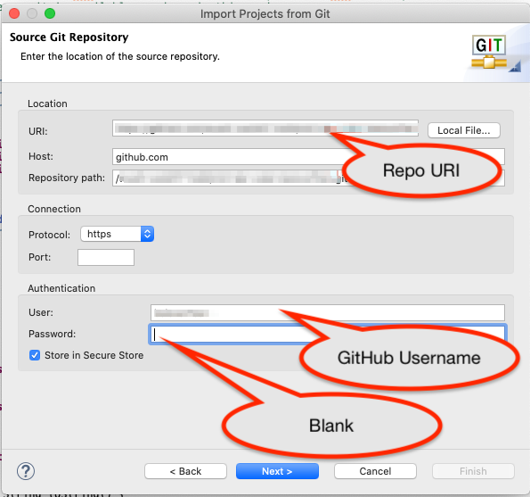
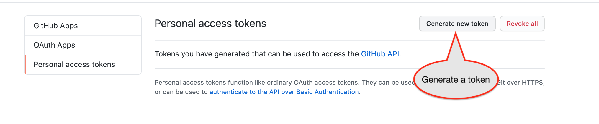
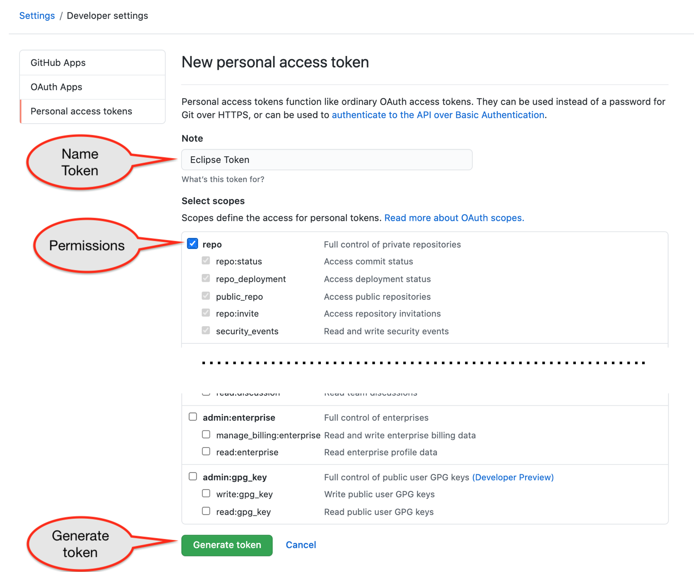
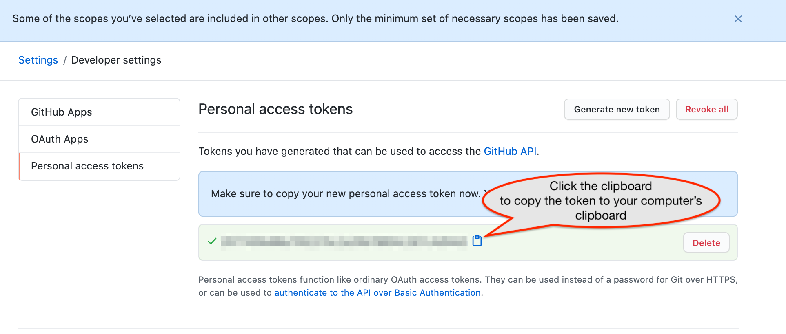

# Acquiring and Using a GitHub Key

GitHub requires using secure keys to work with tools like Eclipse.  You'll need to generate a key on your GitHub account and then configure Eclipse to use the key as your password the first time you import a repository.  You'll have Eclipse save the key, so you won't have to do this again.
  
## 1. Go through the import process until you get to the page asking for your GitHub username and password

Start the import process using the URI for your repository.  Provide your username, but NOT your password (yet):  

## 2. Generate a developer key on GitHub

1. Go to GitHub.com's Personal Access Tokens page: [https://github.com/settings/tokens](https://github.com/settings/tokens)

2. Click the `Generate new token` button  

3. You'll have to enter a token name ("Eclipse Token" is appropriate), indicate permissions (check `repo` at a minimum), and click the `Generate Token` button):  < br/>

4. Click the clipboard icon to copy the resulting key to your computer's clipboard:  

## 3. Paste the token into Eclipse and save it

1. Paste the token into the `Password` field in Eclipse and select the `Save in Secure Store` checkbox:  
