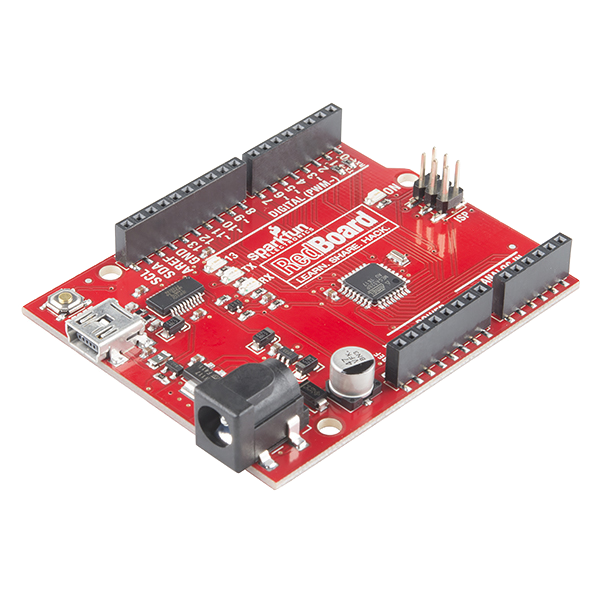
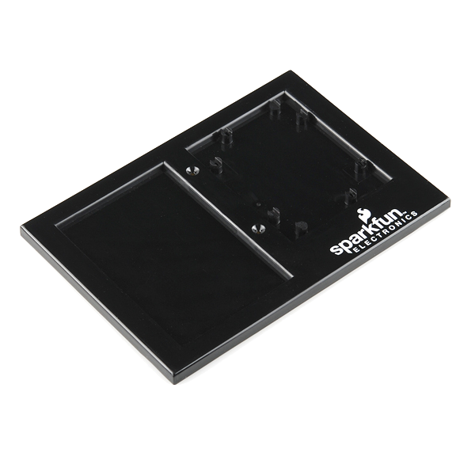
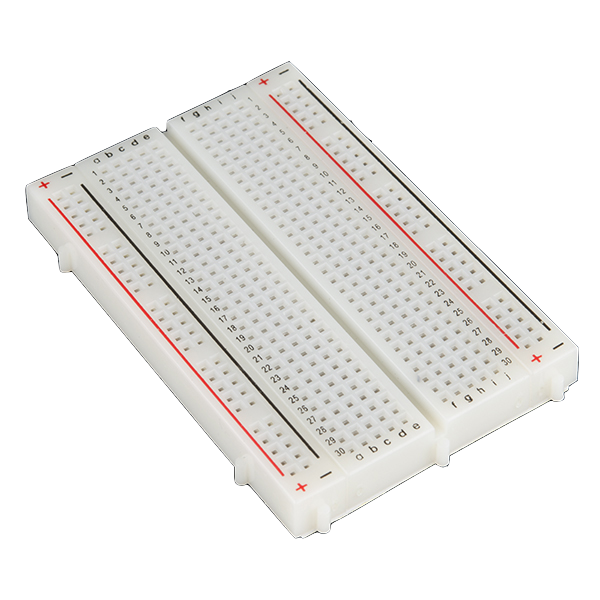
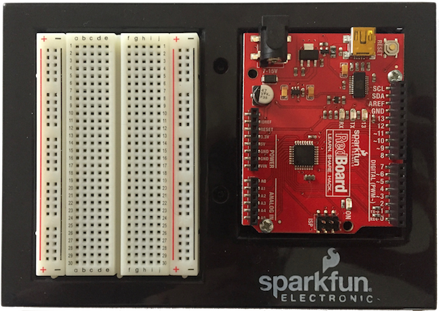
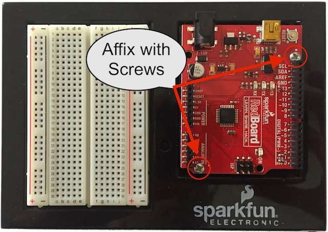
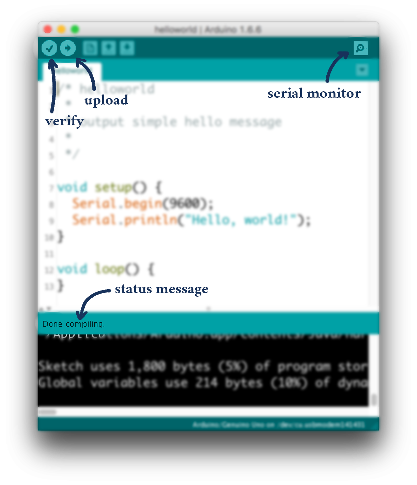

# {{ page.title }}

## Access your repository

We will be using [git](https://git-scm.com/) to distribute the code you need for studios and assignments. You will also use git to turn in your work. Here\'s a great video that explains what git is and how it works:

<iframe src="https://player.vimeo.com/video/41027679" width="640" height="360" frameborder="0" webkitallowfullscreen mozallowfullscreen allowfullscreen></iframe>

Before you can complete any of the assignments, you must set up your repository. You can find instructions on how to do this [here](../../../guides/setup-git.html).

The link to access Studio 0 is [here]({{ "/tbd.html" | relative_url }}). Read the guide before clicking this link!

## Introduction to Arduino

The Arduino is a (very) small computer that has dramatically fewer capabilities than the desktop or laptop machines that you have used in the past to run Java programs. For example, it doesn\'t have a keyboard, it doesn\'t have a screen, its processor is well over 100 times slower, and you might even be wondering, "what is the point?" The point is that small computers like the Arduino are priced relative to their capabilities. Want a computer for under \\$10? If so, the Arduino is a great choice! Its small size makes it incredibly useful for lots of jobs where it would seem overkill to use a $1500 laptop. Over the course of the semester, we\'ll discover all that the Arduino can do, even though it starts out as humbly as it does.

### Assembling the Arduino Board

You will need to assemble your the main components of your Arduino kit:

The Arduino RedBoard:

The BreadboardHolder:

And the (solderless) Breadboard: 

When done, it should look like: 

You will need to:
1. Attach the Breadboard to the Breadboard holder *with the labels on the breadboard facing the correct way, as shown above*.  The breadboard has an adhesive backing.  Remove the protective layer and stick it to the holder in the indentation. The column letters a-j on the top and bottom of the breadboard should be in the same direction as the "sparkfun" label on the breadboard holder.   

2. Put the RedBoard on the Breadboard Holder. Again, the print/labels should match those shown above.  The Redboard has four holes for screws and the kit includes two screws.  Any two holes will be suitable, but diagonal holes are recommended.  Screwdrivers are available from the instructors and TAs.

### Programming the Arduino

Although the Arduino itself is a computer separate from your laptop or desktop, its lack of screen serves as an impediment to programming it directly. We write and compile programs for it on a larger computer and then send them over to the Arduino via USB. The Arduino, as you\'ll soon see, runs one program at a time, for as long as it\'s plugged in.

As you might imagine, the transfer process is very complex, and until the Arduino came out in 2005, microprocessor programming was a [long and arduous task](http://ww1.microchip.com/downloads/en/appnotes/atmel-0943-in-system-programming_applicationnote_avr910.pdf). Luckily for us, we are past those dark ages of computing and we have the **Arduino IDE** (Integrated Development Environment). You may be familiar with the *Eclipse* IDE, which we use in CSE 131 to write and compile Java programs. The *Arduino* IDE helps you write and compile Arduino programs and also manages uploading those programs to your Arduino board.

Arduino programs, however, are not written in Java. They are written in a variant of C, one with extra libraries specifically for writing Arduino programs. If you have already been introduced to C, programming the Arduino should be a snap.

## Exercise

In this exercise you will get accustomed to the basics of Arduino C by writing a simple "heartbeat" program and uploading it to your Arduino board.

Then you will write an identical program in Java and compare the two programs to understand the differences between the two systems.

### Objectives

By the end of exercise, you should know:

- how to **structure a basic Arduino program**,
- how to **use the [Arduino reference guide][arduinoref]**, 
- how to **communicate with your Arduino**, and
- how to **use Arduino digital output pins**.

[arduinoref]: https://www.arduino.cc/en/Reference/HomePage

Onward!

## Setting up Arduino

<aside class="warning">
To use your own laptop for development, you\'ll find the Arduino IDE [on the official site](https://www.arduino.cc/en/Main/Software), for Windows, Linux, and Mac.  Don\'t use the web editor, install the latest IDE (currently 1.8.10) on your machine.

[//]: If you have *any* trouble with the installation process, finish the studio exercises using one of your group\'s computers, and *then* ask for help with the installation.

[//]: Do the studio today. Install the software later.
</aside>

### Getting ready

First, you need to check out your repository so that you can commit the changes you make today. You may also need to tweak Arduino\'s preferences to make it easier to use.

1. Organize around one computer, using the large screens on the walls to make things easier if you need.
2.	Open Eclipse. (If you haven\'t already installed Eclipse, see the instructions [here](https://classes.engineering.wustl.edu/2020/spring/cse131/videos/InstallEclipse/))

	Make sure to note where your **Eclipse workspace** is located. You will need it.
	
	If you don\'t know, `File>Switch Workplace>Other...` will show you. Press `Cancel` if you don\'t want to change it.
3. Make the font size bigger if necessary.
4.	Check out your repository.
	
		
In CSE132 this semester, we will be using Git as our version control system.
We have made a [git Tutorial](../../../guides/setup-git.html) to get your workspace set up and running.

Make a note of the `Local Destination` directory, as it will be needed later.

### Running a program

In Eclipse nagivate to the studios.studio0 helloworld.ino file. If the icon shows the Arduino icon (blue/green circle with a white infinity symbol), double click on the file. If not, right click on the file name and select `Open With > Other...` and select the Arduino application (called `Arduino file` on Windows systems).

The `helloworld.ino` file is a complete Arduino program. Compiling and uploading it should help you learn the Arduino interface.

<aside class="sidenote">
#### Problems uploading?

Considering that you are compiling a program from C, using an old USB driver designed by one company to communicate with a board designed by another company running code designed by a third, it\'s surprising that Arduino upload works as often as it does.

But stuff goes wrong. A lot. Here\'s how to troubleshoot your upload.

- **Is your code free of syntax errors?** Make sure that your code is correct (**Verify** it and make sure the status is `Done compiling.`)
- **Are you writing to the correct port?** Look under `Tools>Port>` and select a different one. On Windows it will be something like `COM3`. On Mac, it will be something like `/dev/cu.usbmodem1492`. There\'s no good way to find the correct one aside from guess-and-check.
- **Restart the Arduino IDE and plug everything in again**. It works a lot of the time.
</aside>

1. Click the **Upload** button to *compile* `helloworld` and *upload* it to the Arduino (the **Verify** button just compiles your program, looking for errors in the code).
2.	Make sure the code uploaded correctly (the **status message** should say `Done uploading.`).
3. Open the **Serial Monitor** to view the output that our newly programmed Arduino writes to its *serial port*. You should see the phrase `Hello, world!`.
4. Press the **reset button** on your Arduino board. The Serial Monitor should  display the phrase `Hello, world!` again.  **Important:** Note that in the bottom right of the Serial Monitor there is a dropdown box that by default reads `Newline`. **Change this to the `No line ending` option**. This has to do with input to the Arduino from the keyboard. Although this studio will not provide keyboard input to the Arduino, future studios and assignments will, and it is important that the `No line ending` option is selected or unintended isues may arise. You should get into the habit of making sure this option is selected.
5. The Arduino has two **entry points** into your code, or, in other words, two places it looks to run your code. Whenever the Arduino starts up or is reset, the Arduino runs the `void setup()` function once. After that, the Arduino runs the `void loop()` function over and over until the Arduino is unplugged or reset.

	Opening serial monitor or pushing the reset button on the Arduino both reset the Arduino.
	
	Note that opening the serial monitor will sometimes print garbage data as the signals between the Arduino and computer sync up.

## Timing in Arduino

Now you\'ll write your own Arduino program in C.

1. Take a quick look at the [Arduino reference][arduinoref]. It should be surprisingly similar to Java. 

	Pay special attention to the `Serial` library (under *Communication* in the *Functions* section) and the `delay()` function.
2. Author a program called `heartbeat` in the `studio0` folder (so the `heartbeat.ino` file should be in `studio0/heartbeat/`) that, once per second, prints:

		<n> sec have elapsed
		
	where `<n>` is the number of seconds that have passed since the program was reset. The `delay()` function will come in handy, as will `Serial.print()` and `Serial.println()`.
		
	
	 Note that C strings work differently than Java strings (namely `string  + string` does not exist in C, and Arduino C does not support `printf()`), so you\'ll need to work around that. The [Arduino reference page on strings](https://www.arduino.cc/en/Reference/String) explains the C implementation in more detail. 
4. Verify that your newly authored program is functioning at least approximately correctly.

## Digital output in Arduino

The program you just wrote could easily be a Java program on your laptop (as it will soon be), and does not show off the power of the Arduino. We\'ll add a flashing light to show off the critical feature of the Arduino: it can interface with everyday electrical circuits.

1. You probably noticed the numbered holes on each side of the Arduino. We call these **pins**. The Arduino code you create can read and write electrical signals from these pins: they can turn on and off lights (as we will do today), read whether or not a button is pressed, or determine how far a knob is turned, as long as you wire up the correct circuit.

	Circuits are hard, so we will use *pin 13*  because it is already attached to an LED on the Arduino body itself, and so requires no wiring on your part. Later, we will walk through attaching your own LED to pin 13. This code will power it just the same.
2. In your `setup()` function, ensure pin 13 is ready to write by setting its `pinMode()` to `OUTPUT`. Look at the [Arduino reference](https://www.arduino.cc/en/Reference/PinMode) explains the C implementation in more detail. 
 for `pinMode()` to learn how.
3. Modify your `loop()` to blink the LED every second, just before it `Serial.print()`s. You will need to divide your loop into *two* `delay()`s---one where the LED is on, and one where the LED is off.

	You can turn the LED on and off by turning on and off the pin it\'s attached to. In computer science terms, you **write `HIGH` or `LOW` to the pin**. The aptly named `digitalWrite()` function will help you do this. Check the [Arduino reference](https://www.arduino.cc/en/Reference/DigitalWrite) to see how this function works.
4. Make sure your program still beats approximately once a second.

## Timing in Java

Now write the earlier timing program in Java.

1. Create a new class `Heartbeat` in the `studio0` package. Make sure you include a `public static void main(String[] args)` method so that your new class can be a standalone Java program. You can do this within the **New Java Class** wizard.
2. Your `Heartbeat` program should print a message to console once per second. Use `Thread.sleep()` to measure the passage of time, as described in class. Remember that `Thread.sleep()` can throw an exception, and you should use `try {} catch() {}` blocks to catch any exceptions.
3. Verify the program works reasonably.

## Comparison

Now compare how good your Arduino is at keeping time compared to your desktop or laptop.

1. Start up both programs and observe how long it takes to start drifting in time relative to one another. 
2. Add some code to your Arduino program that displays the return value from the `millis()` function. How many milliseconds should elapse every iteration? What do you actually see? What does this imply about the reliability of timing using `delay()`?

## Finishing up

Check out and get out.

1. Make sure to *commit* your workspace

	In Eclipse\'s package explorer, any files you have modified since your last commit are prefixed with a `>`.

	If you have saved some files from the Arduino IDE, they might not yet appear in the navigation pane of Eclipse.  Right-click on your repo and choose `Refresh` and they should show up.
	
	Right-click the outer-most folder (you want to commit *everything* within), and choose `Team>Commit...`. Write a helpful message and press `Commit and Push`.
	
	You can verify that your changes went to the server by going to your GitHub page for your repository. Click the "Source" link on the left side of the page and make sure your file exists with the code that you wrote.

2. Show your two timing programs and your repository to a TA.
3. Tell your TA how long it took for your Arduino and computer to get out of sync.

Repository structure for this lab:

<section class="tree">
- `studio0/`
	- `helloworld/`
		- `helloworld.ino`
	- `heartbeat/`
  	  - `heartbeat.ino`
	- `Heartbeat.java`
</section>

## Key Concepts
<aside class="sidenote">
This is a mental checklist for you to see what the Studio is designed to teach you.
</aside>

- Arduino 
	- Navigating the Arduino IDE 
	- Using LEDs 
	- Timed LED blinks
		- delay()
	- Sketchbook location
	- Uploading Problems
- Java / PC 
	- Eclipse workspace setup   
	- Timed printing
	- Committing with Eclipse 
- Reliability of Timing
	- PC vs Arduino
	- delay()
