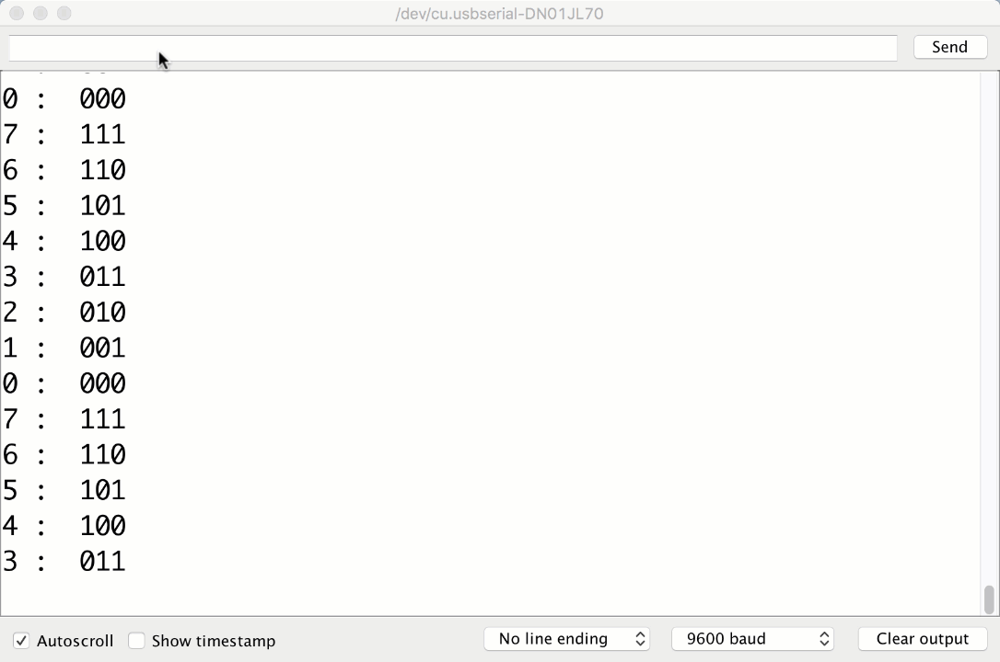



# {{ page.title }}

## Access your repository

Click [here]({{ "/tbd.html" | relative_url }}) to access the Canvas page with the repository for this assignment.

## The idea

This assignment contains two parts: binary puzzles and a binary counter.
In this assignment you will: a) use bitwise and Boolean operators to solve basic logical operations on numbers and b) use finite-state machines to model a binary counter. These logic puzzles will help you better understand how binary fits into the day-to-day mechanics of computing. In other words, this assignment will help you think about how computers actually look at and understand data that they interact with.   

## Objectives

By the end of this assignment, you should know:

### Part I  Binary Puzzles
- how to use **bitwise** and **Boolean operators**
- when to use specific **numerical Arduino data types**
- how to read **function signatures**
- how to **structure Arduino code**
- how to **automate the build process**

### Part II Binary Counter
- **FSMs**
	- How to make them 
	- When to use them 
	- How they can help a program's clarity and design
- What an **enum** is and how it is helpful to a programmer
- how to print to the **Serial Monitor**
- how to call **functions** in Arduino C
- how to **count to 7 in Binary**
- how to use `delay()`

## The background

### Bitwise and Boolean operators

It's hard to talk about numbers at all without talking about **operators**. You should be familiar with many of them already: `+`, `-`, `*`, etc. They take one or two numbers and *operate* on them, changing them. We introduce two new groups of operators: **bitwise** operators and **Booleans** ones. 

**Bitwise operators** are operators that act directly on the individual bits of a binary number, whereas **Boolean operators** (also known as logical operators) operate on the "logical values" that the complete number represents: in Arduino, `0` is a logical `false`, and anything else is `true` (even `-1`).

In a sense, these two groups of operators are very closely related: both operate only on two values (Boolean operators treat everything as either `true` or `false`, and bitwise operators operate on the underlying bits of numbers which can each only be `0` or `1`), and as you'll see in a bit, they perform very similar operations on these values. Their main difference is their scope: bitwise operations work on each bit individually, whereas Boolean operations work on the numbers as a whole.

#### The operations proper

- [**Bitwise AND**](https://www.arduino.cc/en/Reference/BitwiseAnd) (`c = a & b`),  `c`  has `1`s in the places where both of the corresponding bits in `a` and `b` are `1`.
- [**Bitwise OR**](https://www.arduino.cc/en/Reference/BitwiseAnd) (`c = a | b`),  `c` has `1`s wherever *at least* one of the corresponding bits in `a` and `b` is `1`.
- [**Bitwise XOR**](https://www.arduino.cc/en/Reference/BitwiseAnd) (`c = a ^ b`),  `c` has `1`s wherever one *and only one* of the corresponding bits  in a and b is `1`.
- [**Bitwise NOT**](https://www.arduino.cc/en/Reference/BitwiseXorNot) (`c = ~a`),  `c` is `a` with each bit inverted.
- [**Right shift**](https://www.arduino.cc/reference/en/language/structure/bitwise-operators/bitshiftright) (`c = a >> b`),  `c` is `a`, with each bit moved lower `b` places.
- [**Left shift**](https://www.arduino.cc/en/Reference/Bitshift) (`c = a << b`),  `c` is `a`, with each bit moved higher `b` places.
- [**Boolean AND**](https://www.arduino.cc/en/Reference/Boolean) (`c = a && b`),  `c` is `1` if both `a` and `b` are non-zero.
- [**Boolean OR**](https://www.arduino.cc/en/Reference/Boolean) (`c = a || b`),  `c` is `1` if either `a` and `b` are non-zero.
- [**Boolean NOT**](https://www.arduino.cc/en/Reference/Boolean) (`c = !a`),  `c` is `1` *only* if `a` is `0`. 

### Characters, integers, & longs 

Not all numbers are the same length.  Because of this it is useful to have several different [data types](https://learn.sparkfun.com/tutorials/data-types-in-arduino) that we can choose from for storing differently sized numbers.  In this way we don't waste space storing small numbers in large spaces.  The three data types we will use in this lab are characters (`char`: 1 byte), integers (`int`: 2 bytes), and longs (`long`: 4 bytes), each of which store whole numbers. 

By default, all of these values are `signed` and can store both positive and negative numbers. Their possible values  range from $-2^{n-1}$ and $2^{n-1} - 1$, where `n` is the number of bits in the data type. `unsigned` numbers range from $0$ to $2^{n}-1$. e.g. [`unsigned char`](https://www.arduino.cc/en/Reference/UnsignedChar), [`unsigned int`](https://www.arduino.cc/en/Reference/UnsignedInt) and [`unsigned long`](https://www.arduino.cc/en/Reference/UnsignedLong).

[Two's complement](https://en.wikipedia.org/wiki/Two%27s_complement) is used here to store `signed` numbers. If you still have confusions about `signed` and `unsigned` numbers, please read [Introduction to Information Representation]({{ "/intro-to-information.html" | relative_url }}) guide for detailed explanations.

- [**Characters (`char`)**](https://www.arduino.cc/en/Reference/Char) : Smallest addressable unit that can contain integer data.  They are 1 byte (8 bits) in length.  Signed characters range between `-128` and `+127`.
- [**Integers (`int`)**](https://www.arduino.cc/en/Reference/Int) : Standard unit to contain integer data.  In Arduino C, they contain 2 bytes---16 bits.  Signed integers range between `-32,768` and `32,767`.
- [**Longs (`long` or `long int`)**](https://www.arduino.cc/en/Reference/Long) : In Arduino C, they contain 4 bytes or 32 bits.  Signed longs range between `-2,147,483,648` and `2,147,483,647`.

**Note:** Data types in [Java](https://docs.oracle.com/javase/tutorial/java/nutsandbolts/datatypes.html) or [C](http://www.tutorialspoint.com/cprogramming/c_data_types.htm) have different lengths than in Arduino C.

## The Assignment

### Part I  Binary Puzzles

 Open the Arduino sketch called `binaryPuzzles`.

1. #### Bit shifting!
	 Complete the functions `shiftRight` and `shiftLeft`.

	- `int shiftRight(int num, int n)`: Shift `num` to the right `n` bits.
	- `int shiftLeft(int num, int n)`: Shift `num` to the left `n` bits.
	
2. #### Bit manipulations!
	
	For each function below, use only the bitwise and Boolean operators listed above (i.e., **no `if-then` tests or `while` loops** are allowed) to write functions that return `1` if the input matches the condition given and `0` otherwise. You should be able to solve each in one line.

	- `int hasAOne(int num)`: At least one bit in `num` is a one (Binary Representation). 
		  E.g. 7 is 111 in base 2. Therefore hasAOne(7) should return 1(true).
	- `int hasAZero(int num)`: At least one bit in `num` is a zero.
	- `int leastSigHasAOne(int num)`: At least one bit in the *least* significant byte(the last byte) of `num` is a one.
	- `int isNegativeInt(int num)`: the integer `num` is negative.  **Hint**: We use **Two's complement** to represent signed numbers.
	- `int isNegativeLong(long num)`: the long `num` is negative.  Remember, in Arduino C `long`s are 4 bytes (32 bits) in length.
	- `int isNegativeChar(char num)`: the char `num` is negative.  Remember, in Arduino C `char`s are 1 byte (8 bits) in length.
	- `int negate(int num)`: Return the two's complement negation of `num`. This function should return a number instead of `1` or `0` (true or false).  **Exception**: You are allowed to use the + operator for this one (not allowed for the functions above).

### Part II  Binary Counter
	
This part has two components: drawing a FSM, and modeling said FSM on your Arduino. 

#### Setup
		
- Connect your Arduino
- Open `FSM / FSM.ino`  

#### The Model 

The [Studio](../studio) has useful information for this lab. If you were unable to finish the studio last class we recommend you look it over before starting on the assignment.

##### Interpreting FSMs and FSAs

Here is the drawing of the Studio 1 FSM:

- The **circles** represent the possible states the machine can be in, and each circle has its own set of instructions. 
- The **arrows** represent the possible movements the machine can make.
- Notice that this FSM has no inputs. It continuously progresses from one state to the next. This is about to change!

##### Drawing Your Model

- Draw a FSM to model a Binary Counter that can reverse directions
	- You are welcome to turn in a picture of one drawn by hand, but we recommend this [Finite State Machine Designer](https://wilsonem.github.io/fsm/). This program allows you add, move, and delete states more freely than pen and paper.
	- Save the PNG or other image format to your repository in the `FSM` directory.
	- We want to use an input to dictate when we should reverse directions. For this lab, our input will come from the keyboard. In your FSM however, you could represent the input as a binary value: 1 if a key has been pressed, and 0 if not.
	- *Hint -- your model should have 16 states* One set of states is for counting up and another set for counting down. If you were to only use 8 states to represent the current number, how would the FSM know whether it should count up or down? We would need another variable to keep track of which way we are counting (which effectively adds additional states to the FSM in a rather crude and unsophisticaed way). 

#### The Program 

##### Transferring FSMs to Code

- Return to `FSM.ino`
- Complete the function `determineNextState()`  with a **FSM** to determine the next state of the machine.
	- Using your FSM drawing as a guide, your FSM should have **16** states and a matching `enum`.

Here is an Example of an Enum in Arduino C:
   
	enum Direction {
  	 North,			// North = 0
  	 East,			// East = 1
  	 South,			// South = 2
  	 West			// West = 3
	} direction = North;

 - **Recommended** -- use  `switch`  statements to *switch* between your states using  `cases` 
	- Correctly designed `if` statements will also be accepted

Here is some pseudocode to demonstrate `switch`:

	month = 2
	switch (month) {
		case 1:
			print 'January'
			break
		case 2:  		// switch to case 2 because month == 2
			print 'February' 	
			break		// break so other cases won't run
		case 3:
			print 'March'
			break
		... 
	}

##### Adding the Reverse Button

- Complete the function `checkReverse()` , which **reverses** the direction of the counter **if** a key on the keyboard has been pressed.
	- To check if a key on the keyboard has been pressed, you can use [Serial.read()](https://www.arduino.cc/en/Serial/Read). Take a look at the documentation to see how this function works, then use it to complete this method. 
	- For this lab, we don't care which key has been pressed, we only care about whether or not any key has been pressed.
	- If the user has input something, `checkReverse()` should update the state to reflect this. (Be sure the serial monitor has `No line ending` selected.  Other options, like `Newline` will send one or more additional characters and may cause it to reverse multiple times.)**

##### The Final product
Your Output should look close to this:

   

We also accept reversing after the next state change, as shown in this older [video](FSM_Final_old.gif).  Note that it also showed state bits in the incorrect order (least significant bit leftmost rather than rightmost). 

## The check-in

1. Commit and push your code (and FSM), then verify in GitHub that it is all there.
2. Follow the checklist below to see if you have everything done **before** demoing your assignment to a TA.
	- Part I Binary Puzzles
		- All functions work correctly (45 points)
			- `shiftRight(int num, int n)`
			- `shiftLeft(int num, int n)`
			- `hasAOne(int num)`
			- `hasAZero(int num)`
			- `leastSigHasAOne(int num)`
			- `isNegativeInt(int num)`
			- `isNegativeLong(long num)`
			- `isNegativeChar(char num)`
			- `negate(int num)`
	- Part II Binary Counter
		- Drawn FSM (20 points)
			- 16 states
			- correctly models the counter
		- FSM (30 points)
			- determineNextState() filled out and working
			- 16 states
			- uses enums
			- switches from state to state with switch or if statements
			- working counter printed out in the Serial Monitor
		- Reverse Button / Lever (5 points)
			- can switch the direction of the counter
	- All of your files are committed

3. Assignment Demo
	  
<pre>
0  :  000
1  :  001
2  :  010
3  :  011
4  :  100
--Reverse--
3  :  011
2  :  010
1  :  001
--Reverse--
2  :  010
3  :  011
--Reverse--
2  :  010
1  :  001
0  :  000
7  :  111
6  :  110
5  :  101
--Reverse--
6  :  110
7  :  111
0  :  000
--Reverse--
7  :  111
6  :  110
5  :  101
4  :  100
</pre>

4. Check out with a TA.


