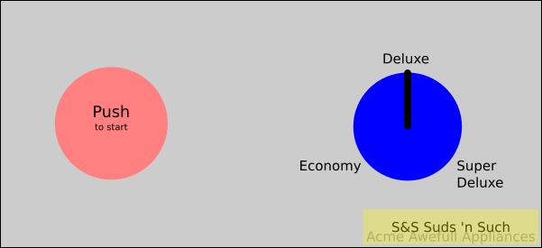
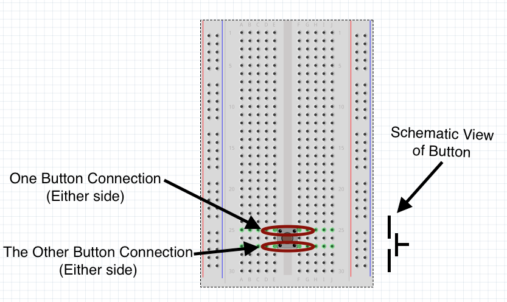
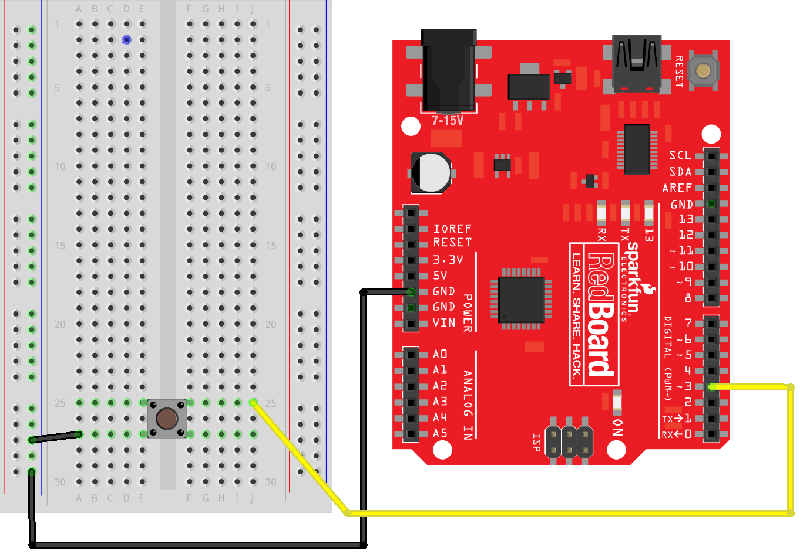
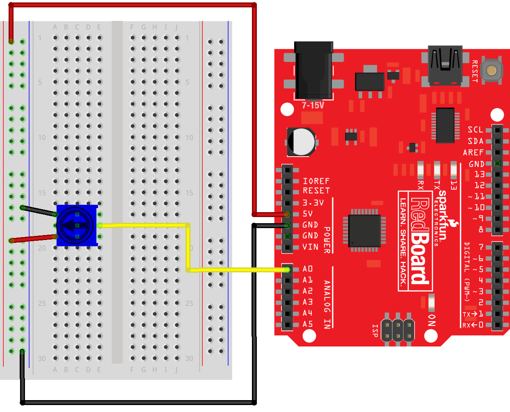



# {{ page.title }}

Click [here](https://wustl.instructure.com/courses/68860/assignments/289458) to access the Canvas page with the repository for this assignment.

## Objectives

As you've noticed, the Arduino is a type of programmable computer.  Its main chip (the Atmega328), is a *microcontroller* rather than a *microprocessor*, like the Intel CPUs in most laptop and desktop computers.  As the name implies, microcontrollers are used to *control* things. Consequently, micro*controllers* typically have several features that make them amenable to controlling things.  For example, the Arduino can determine an analog voltage, which microprocessors can't typically do.

The goals of this assignment are to:

* Practice putting Finite State Machines to use,
* Work with input on the Arduino, and
* Gain a better understanding of microcontrollers (like the Arduino).

## The Idea

S&S Enterprises has recently acquired several hundred defective dishwashers at a clearance sale.  They'd like to fix these pieces of junk and sell them as soon as possible.  In fact, they've already "rebranded" them by placing a sticker with the S&S product name over the original manufacturer's name.  Now they just need some computer engineering expertise to fix them...and that's where you come in...

Through painstaking testing S&S has determined that all the machines suffer from a faulty control board.  They believe a properly programmed Arduino will be able to replace the control board and restore the dishwashers to working order. 

### Inputs

Fortunately, the dishwashers are rather simple.  The control panel provides just two inputs:

1. Start push button (on the left) 
2. Cycle knob (a potentiometer with three positions on the right)

The knob dictates the phases of washing.

### Outputs

The washing machine control board also has several outputs.  Each is a simple digital (ON/OFF) signal.  The control signals are:

1. Hot water on
2. Cold water on
3. Dryer on
4. Locked (On means the door is locked)

Using an actual machine for your testing would be awkward, so you should simulate the outputs by using LEDs.  Use:

1. Red for hot water
2. Green for cold water
3. Yellow for the Dryer
4. The Blue LED that's already on Pin 13 for Locked

### Wash Cycles 

Since the controls are pretty primitive, the washer can only support three types of wash cycle:

Economy
: Washes dishes in cold water for 5 minutes and then runs the dryer for 2 minutes. (To speed up testing, we will use seconds as the unit of time rather than minutes. Anyplace that indicates time as "X minutes" you should actually use "X seconds")

Deluxe
: Washes dishes in hot water for 7 minutes and then runs the dryer for 7 minutes.

Super Deluxe
: Washes dishes in hot water for 7 minutes, then in medium water (both hot and cold) for 7 minutes, then finally runs the dryer for 7 minutes.

S&S would like to give users the flexibility to change the "next cycle" by adjusting the control knob in the middle of the current cycle. In particular they'd like:

1. If the knob is changed to Economy during a hot or medium water cycle, it should proceed to the same dry process used in the Economy wash.
2. If the knob is changed to either Deluxe or Super Deluxe during a cold wash cycle it should proceed to the same drying behavior as Deluxe or Super Deluxe.

Also keep in mind that the door to the washer should be locked whenever it's running.

## Getting Started

### Planning

Start by drawing out a Finite State Machine diagram for the dishwasher. 
As a reminder, we recommend this [Finite State Machine Designer](https://wilsonem.github.io/fsm/).
Please indicate which state your FSM starts in by drawing an arrow to it, and clearly label each state and transition. 
Here are some things to consider as you are trying to create your diagram:

1. How many states are there?
2. How do the inputs impact the changes from state to state? (What are the "conditions" on the arrows of the state diagram?)
3. How are outputs impacted by state?
4. How long should states last? 

### Arduino Prep

1. Remember that the Arduino always starts running a program when it is powered. Running an old program with different circuitry can cause damage to the Arduino, the circuitry, and possibly things the circuitry controls.  To reduce the chances of this type of damage when you are starting a new project:
	1. Disconnect your Arduino from the computer
	2. Disconnect any circuitry from the Arduino
	3. Plug the Arduino back into the computer
	4. Open a new, blank sketch (just an empty `setup()` and a `loop()`)
	5. Program the Arduino with the blank sketch
	6. Unplug the Arduino and make changes to the circuit. Double check circuits, connections, and make sure the `setup()` configures pins correctly before powering the Arduino.

### Arduino Inputs

#### Buttons

The start button will require an actual button.  When pressed the buttons will make a connection between the two connectors on the top of the button and the two connectors on the bottom:

The button will be connected to a digital pin.  To keep things simple, make the `pinMode()` be `INPUT_PULLUP` for the button.  `INPUT_PULLUP` will pull the value of the input pin UP (to `HIGH`) by default.  The button will then be used to pull it down (to `LOW` or ground).

The buttons will be connected as follows:

Notice that a digital pin is connected to one side of the button and the
other side of the button is connected to ground.

`digitalRead( PIN_NUMBER )` will be used to determine if the button is pressed or not.  If the button is *NOT* pressed, the `digitalRead()` will return `HIGH` (due to the pull-up).  If the button *IS* pressed, the input will essentially be connected to ground, and, consequently the `digitalRead()` will return `LOW`.

Make sure you understand how the button works by creating a simple sketch that just prints the values from `digitalRead()`.

#### Potentiometer

The potentiometer can be used as a variable resistance. Here it will be used to control an electrical potential (i.e., voltage), which the Arduino will be able to read via the [`analogRead()`](https://www.arduino.cc/en/Reference/AnalogRead). Consequently, the potentiometer should be connected to an analog input pin. 

 

Make sure you understand how the potentiometer works by creating a simple sketch that just prints the values from `analogRead()`.  (Simple sketches like this that are used to just test a feature shouldn't be in your repository.  You can create it by just using `File > New` from the Arduino IDE and then saving it in a default location.) Based on this test sketch you should be able to find a way to determine if the switch is all the way to the left/counter-clockwise, or if it's in the middle, or if it's all the way to the right/clockwise.

## Sketch

The sketch already contains a `Washer` package with a partial, but incomplete `Washer.ino` sketch.

## Hints

* You may need to include an "idle" state for when the dishwasher is waiting to run.
* Your dishwasher should be able to run multiple cycles without having to restart your Arduino.

## The check-in

1. Commit your code and verify in your web browser that it is all there.
2. Follow the checklist below to see if you have everything done before demoing your assignment to a TA.
	- Button is wired correctly
	- LEDs are wired correctly and resistors are chosen properly
	- Potentiometer are read correctly
	- The cycles are all for the appropriate times (and use seconds rather than minutes)
	- All of your files are committed
3. Assignment Demo: This video shows a working version in action:
	  
	<iframe src="https://app.box.com/embed/preview/6n0if5m1ht5lsbyf7xaggofqa7kwdheh?theme=dark" width="640" height="720" frameborder="0" allowfullscreen webkitallowfullscreen msallowfullscreen></iframe> 

4. Check out with a TA.  You will need to show them a clearly drawn FSM diagram.  Things that should be present in your repo structure:
<!-- <section class="tree"> -->
- `Washer/`
  - `Washer.ino`			
<!-- </section> -->

## The rubric

- Washer does all cycles properly
- Cycles are the proper times
- Allows next-cycle to be changed "mid cycle" as described
- LEDs colors represent correct outputs
- Circuit wired correctly
- FSM drawing for dishwasher
- Final code is committed to Github before the assignment is demoed

	
## Misc.

This assignment may at first seem silly, but microcontrollers are at the heart of many everyday devices.  Moreover, you can use an Adruino to fix a broken dishwasher as seen in this [HackADay](http://hackaday.com/) article: [Hey OEMs, Arduino Controlled Dishwasher Has Much Potential](http://hackaday.com/2011/05/26/hey-oems-arduino-controlled-dishwasher-has-much-potential/)


