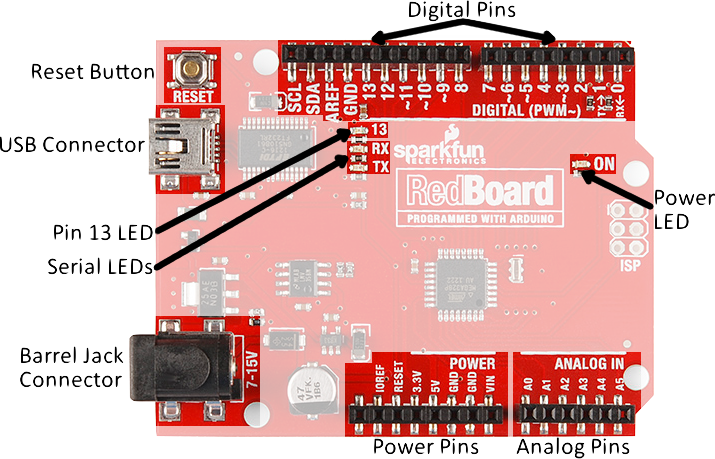



# {{ page.title }}

Click [here](https://wustl.instructure.com/courses/58988/pages/studio-2) to access the Canvas page with the repository for this studio.

## What is a circuit?

This is a pretty complex question, and there are many other topics needed to give a good answer. 

Here are some resources:

- Our [Introduction to Circuits]({{ "/intro-to-circuits.html" | relative_url }}) guide is packed with information. 
- [SparkFun's](https://learn.sparkfun.com/tutorials/voltage-current-resistance-and-ohms-law) guide is also really good, and has some great pictures and gifs for the more visual learners.

### What you need to know for this class

We do not expect anyone to be an electrical engineer. We do, however, need you to understand the very basics of circuits and electricity so you can better understand your Arduino.

Please know the basics of these subjects before moving on:

- [Voltage]({{ "/intro-to-circuits.html#what-is-a-flow-of-charge" | relative_url }})
- [Currents and Resistance]({{ "/intro-to-circuits.html#current-resistance-and-you" | relative_url }})
- [Circuit Diagrams]({{ "/intro-to-circuits.html#how-to-make-a-circuit" | relative_url }})
- [Breadboards]({{ "/intro-to-circuits.html#the-breadboard" | relative_url }})

## Today's studio

Armed with your new circuit knowledge, you will be **modeling studio 1's Binary Counter with 3 LEDs**

### Objectives

By the end of studio, you should know:
- How to **construct a working circuit**,
- How to **use Arduino digital output pins**,
- How to **read basic circuit diagrams** (with voltage sources, LEDs, and resistors), and
- How to **see the pinMode and what setting it means**.

### Setup 

***Important: for your first couple of circuits, let a TA check over them before plugging in your Arduino***

- Create and/or join a group and add the repository to Eclipse.
- The repository already has a `circuits` package that contains an empty `circuits.ino`.  Open it and use this file for your work.
	- You can use your Studio 1 code as a starting point for this studio
- Connect your Arduino to the PC
	- Check your port
- Materials
	- 3 LEDs
	- 3 Resistors (use a resistor value around 300 ohms)
	- 4 Wires

### Wiring up the Binary Counter

**Warning** messing with electricity is never a good idea. The Arduino is a pretty safe place to start but you should develop a **healthy respect for electricity**. 

**Warning:  <u>always</u> disconnect power from the Arduino before doing (or changing) any wiring.  An accidental mis-connection can damage either/both your Arduino and/or the parts you are connecting.  Double check work before applying power**

Here is your RedBoard:

Here is how to wire up one LED:
 
[Wiring up an LED](https://wustl.box.com/s/0uunhcsczx7xz12huyzuw31vcili8hwi)

If you were to issue the command `digitalWrite(3,HIGH);` after wiring one LED as indicated in the video, would the LED light up, or be dark?

- Now wire 3 LEDs with your materials (***Pins 0 and 1 are used to communicate with the Arduino.  Avoid using them.*** )

**Check with a TA before moving on**

### Let there be Light!
 
The Code to make an LED at Pin3 Light up:

~~~ c
void setup() {
	pinMode(3,OUTPUT);
	digitalWrite(3,HIGH);  //HIGH => On and LOW => Off
}
~~~ 

- You printed out **1s** and **0s** for `Studio 1`, modify your code to use those 1s and 0s to determine if LED 1, 2 ,or 3 should be lit.
	- The values of HIGH and LOW are equal to 1 and 0 respectively.   

- Which LEDs should be on (i.e., lit) when you are in state 5? State 3?

## The Final Product

Here is what your LEDs should do:

## Finishing up

1. Make sure to *commit and push* your project.

	Eclipse may not be aware of changes to files that were made outside of Eclipse, such as changes you make in the Arduino IDE.  Right click on the project and select `Refresh` to force Eclipse to search for updates. 

	In Eclipse's package explorer, any files you have modified since your last commit are prefixed with a `>`. 
	
	Right-click the outer-most folder (you want to commit *everything* within), and choose `Team > Commit...`. Write a helpful message and press `OK`.
	
	You can verify that your changes went to the server by opening the repository URL at [GitHub](http://github.com) in any web browser.  Browse the files to make sure your changes committed.

2. Get checked out by a TA.

Repository structure for this lab:

<section class="tree">
- `circuits/`
  - `circuits.ino`
</section>

## Key Concepts
<aside class="sidenote">
This is a mental checklist for you to see what the Studio is designed to teach you.
</aside>

- **Circuits**
	- Currents
		- Power
		- Resistors
		- Components
		- Ground
	- Breadboards
		- Rows vs. Columns 
		- Bus Strips
	- LEDs
		- Anode vs Cathode
		- Backwards?
		- Without a Resistor?
    - Voltage
	- Diagrams
		- Power
		- Resistors
		- Components
		- Ground 
- **Arduino**
	- `pinMode()`
		- OUTPUT
		- INPUT
		- INPUT PULL-UP
	- `digitalWrite()`
- Repository 
	- Eclipse 
		- `Team > Commit...` 


