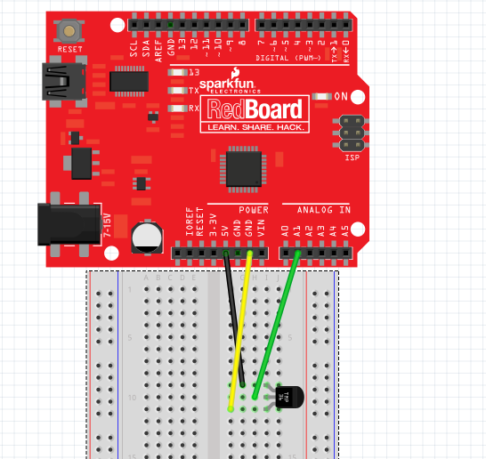



# {{ page.title }}

Click [here](https://wustl.instructure.com/courses/68860/assignments/289459) to access the Canvas page with the repository for this assignment.

## The idea

Crickets chirp at a rate proportional to external temperature: you can [calculate the temperature from the rate at which crickets chirp](https://en.wikipedia.org/wiki/Dolbear%27s_law) to within a degree or so. Of course, you don't always have access to a cricket, so it's come time to build a digital cricket!

## The background

### Spec sheets

Every electrical component has a **specification sheet** (a **spec** sheet). It lists everything you'd want to know about that component and then some. Your Arduino kits include a TMP36 temperature sensor with these specs: [TMP36 Specifications](http://www.analog.com/media/en/technical-documentation/data-sheets/TMP35_36_37.pdf).  

Pages 1 and 3 of the spec sheet have all the information you need to complete this assignment.

### The TMP36

The TMP36 is fairly simple. When a voltage is provided across the two outer pins (in the right orientation), the center pin produces an output voltage based on the temperature. 

You must wire the temperature sensor in the correct way or it will get hot. 
When you insert the TMP36 in the breadboard the pins will be *facing down*.  If *you* are directly facing the *flat side*, the pin on the far left is power, and the pin on the far right is ground. Attach the power pin to +5V and the ground pin to ground.

**NOTE**: The temperature sensor *will burn you* if you wire it incorrectly. *Double check your connections before powering the Arduino.*

The output voltage is independent of the supply voltage: it is a linear function of ambient temperature. At 25°C the TMP36 outputs a specific voltage (written in Table 1 on page 3 of the spec sheet) and as the temperature changes  the output voltage changes based on a **scale factor** (mv/°C), also in Table 1 of the spec sheet). You can use a linear equation to find out the temperature in Celsius using the measured voltage and these two values from the table.

For example, the table also provides data for another sensor, the *TMP35*.  For the *TMP35*, the temperature in Celsius is:

where *TC* is temperature in &deg;C and *Vmeasured* is the sensor voltage in volts (remember, `1 V = 1000 mV`). Of course, the above could be simplified to just:

<b>*Using the data from table derive the equation for the TMP36.*</b>

### Analog Reference

In order to read the temperature output by our sensor, you need to read the voltage into your Arduino.  You have experience with `analogRead()` from an earlier assignment. Now you will use `analogRead()` to read a voltage from the temperature sensor.

An `analogRead()` returns a number between `0` and `1023` that corresponds to a voltage. Usually, the `1023` corresponded to 5V. It turns out that this "upper limit voltage" can be changed. This **reference voltage**, on our Arduinos at least, can be one of two values: 5V or 1.1V.

It's more appropriate to use 1.1V for the TMP36. Using the equation for the TMP36, 1.1V corresponds to 60&deg;C (use this to verify your derivation of the equation from above).   60&deg;C is well above the temperature of Wash U's classrooms. More importantly, using the lower reference voltage gives us more resolution, which means it will give us a more accurate temperature, so it makes sense to use a lower reference voltage.  That is, when we use the 5V reference: $$ \frac{5V}{1023counts} \approx .005 \frac{V}{count} $$ whereas with the 1.1V reference: $$ \frac{1.1V}{1023counts} \approx .001 \frac{V}{count} $$. So the 1.1V reference allows us to measure changes of about 0.001V.  The one downside of the higher resolution is the inability to measure values greater than 1.1V, but we don't expect our sensor to measure temperatures that hot for this application (i.e., hotter than 60&deg;C, which is 140&deg;F; the crickets probably aren't accurate at those temperatures either).

Generally this reference should be configured in the `setup()`.  You can use `analogReference()` to [change the reference voltage to `INTERNAL`](https://www.arduino.cc/en/Reference/AnalogReference).

### Arrays and averages

#### Filtering

The output from your temperature sensor fluctuates due to a variety of factors (including subtle air currents and "noise" in the sensor). In order to obtain a sensible, stable value from the sensor that represents the actual room temperature, we need to **filter** the output to remove these fluctuations.

One option is to build physical hardware to filter: the [RC filter](http://www.electronics-tutorials.ws/filter/filter_2.html) is one such filter, and would do fairly nicely if this were an electrical engineering class. But we want to handle this in software, so we will use a very simple, [OK](http://www.analog.com/media/en/technical-documentation/dsp-book/dsp_book_Ch15.pdf) filter: a **rolling average**.

A rolling average filter determines the filtered value from the arithmetic mean of the *N* most recent measured values. In mathematical speak:

$$ y_t = \frac{1}{N} \sum\limits_{j=0}^{N-1} x_{t-j} $$

Where *yt* is the filtered value at time *t* and *xt* is the measured value at time *t*.  
It's only possible to compute the rolling average if you store the *N* most recent data points, and the easiest way to do this is with an **array**.

## The assignment

Use the existing `cricket/cricket.ino` sketch for your work.  

### The basic system

1. Wire an LED output to the digital output pin of your choice (avoiding digital output pins 0 and 1), include a series resistor, and attach it to ground (this is the same as the discrete LEDs we wired in studio). Make sure you can turn it on and off.

2. Connect the center, output pin of your temperature sensor to an analog pin. Then attach the power pin to `+5V` and the ground pin to `GND`. (Refer to the directions and diagram above.  Double check your work.)

	Make sure you can `analogRead()` from it, even if you haven't set `analogReference()` yet.

3. Write delta time code to read the temperature at 4 Hz (do a `analogRead()` 4 times a second). Test your work so far by using `Serial.print()` to display the value from `analogRead()`.

4. Set `analogReference()` to `INTERNAL`. This will change what each value of `analogRead()` corresponds to (`1023` will now correspond to 1.1V, not 5V), which will be important when you convert the data.

5. Convert the raw `analogRead()` value into a temperature. Mathematically this is a two step procedure, first converting the raw value into a voltage (i.e., understanding what voltage the temperature probe is generating given the A/D counts returned from `analogRead()`), then into a temperature based on the equation you derived earlier using the [spec sheet for the TMP36](http://www.analog.com/media/en/technical-documentation/data-sheets/TMP35_36_37.pdf). 

	While the counts returned by `analogRead()` are of type `int`, you likely will want to use variables of type `float` to perform the computation and store the resulting temperature value.
 		Print out both the raw A/D counts and the converted temperature value until you are confident that your temperature is right. 

 		Gently pinching the black plastic of the temperature sensor between your fingers should show an increasing temperature. 

### The filter

You should now be reading temperature several times per second and printing it out. However, it should be fluctuating because the raw signal is noisy.

Now we will will apply a simple **rolling average** filter to reduce the noise.
	
1. Define a constant at the top of your program called `FILTER_COUNTS` that specifies a number of values to store in the rolling average. A number between 5 and 10 should be reasonable.

2. Then create an array of size `FILTER_COUNTS` to store the `N` most recent data points (i.e., `N` equals `FILTER_COUNTS`). The simplest way to do this is by maintaining a count of the number of reads you do: whenever you read a temperature, save it to this array at index `count % FILTER_COUNTS` (i.e., the remainder when `count` is divided by `FILTER_COUNTS`).

	For example:
	
	
~~~c
#define FILTER_COUNTS 4
float temperatures[FILTER_COUNTS];
unsigned int count = 0;

void loop() {
	if(/* delta time code */) {
		readTemp();	
		/* more delta time stuff */
	}
}

void readTemp() {
	int reading = analogRead(/* pin */);
	int temperature = /* some transform on `reading` */;
	temperatures[count % FILTER_COUNTS] = temperature;
	count += 1;
}
~~~		

If you update the array each time you read the temperature, its mean is the rolling average.

3. Compute and print this rolling average alongside the raw (unfiltered) temperature. Is it more stable? Does it still respond to temperature changes?

4.  Graph the temperature data (unfiltered and filtered) you get from your Arduino.  In addition to the `Serial Monitor`, which displays text data, the Arduino IDE also comes with a `Serial Plotter`, which will Plot data.

If you structure your output something like this, with commas or whitespace (spaces or tabs) separating each field of the data:

		24.12,22.65
		23.44,22.87
		24.04,23.13
		22.57,22.99
		21.21,22.76

each column of numeric data will be drawn as a separate line (that is, each column represents a different series of data). *Close the `Serial Monitor`* and select *`Serial Plotter` from the Tools menu*.
	
Generate a noticeable change (increase) in temperature by gently pinching the temperature sensor and then letting it go a few times. Get a feel for how changing temperature impacts the graph of data and, especially, the impact of filtering.  Also, double check your temperatures to make sure they're reasonable.

***You will need to submit this graph with your repository.  You may want to take a screenshot of it.  (A google search of "screenshot Windows" or "screenshot Mac" will show you how)***

### The cricket part

Now you can use the filtered temperature to make a blinking cricket.

1. [Dolbear's Law](https://en.wikipedia.org/wiki/Dolbear%27s_law) is a formula to calculate the temperature from the amount of cricket chirps in 60 seconds:

	$$ T_C = 10 + \left(\frac{N_{60} - 40}{7}\right)$$
	
	where *TC* is the temperature in Celsius and *N*60 is the number of chirps in a minute.
	
	You can solve this in terms of chirps *per second*. By inverting it (1 / chirps per second) you get a period, *seconds per chirp*. If you convert this number into milliseconds per chirp, you can use this as the duration of a delta time iteration to flash your LED.
	
	Solve this equation to determine a period, a number that you can use in a delta time conditional to flash a cricket LED.
2. However, even with this number, flashing the LED is not that simple. You need to keep track of whether or not your LED is on (like with a [`boolean`](https://www.arduino.cc/en/Reference/BooleanVariables)), and then alternate between *two* intervals for this "flash" delta time loop:

	If the light is on, wait some time `BLINK_DURATION`, which should be around `200` milliseconds, then turn off, and if the light is off, wait for `period - BLINK_DURATION` and turn back on.
	
	Write the appropriate delta time code (separate from your temperature sampling code) to blink the LED based on temperature. Your program should now asynchronously measure temperature and output data to your PC while blinking the LED.
3. Make sure the blink rate is reasonable.

### Guidelines

1. Make sure to wire the temperature sensor correctly or you will burn yourself.

	The pins number from 1 to 3 left to right with the flat side up and the pins facing you. 
	
	1. Power
	2. Output
	3. Ground

	 

	The final circuit schematic should look like this:

	{:width="50%"}

	Note that this picture has the LED connected to the Arduino pin and the resistor connected to ground.  Either order is fine, Arduino pin then LED then resistor then ground, or Arduino pin then resistor then LED then ground.

2. Don't use `delay()` *at all* in this lab. We will *penalize* you if you do. The delta timing alternative we use is an important concept, and if it is not crystal clear, try reading some more about it and working through examples.

	[Adafruit](https://learn.adafruit.com/multi-tasking-the-arduino-part-1/using-millis-for-timing) has a nice tutorial, as does [StackOverflow](http://electronics.stackexchange.com/a/67090). Adafruit takes some code from [the Arduino tutorial](https://www.arduino.cc/en/Tutorial/BlinkWithoutDelay). Work through some problems, try to see if you can understand the idea in a generic form.
3. Save all your math work (conversions of voltage to temperature, Dolbear's law, etc). It will be helpful when your numbers aren't coming out right (trust me, they will be wrong the first time).
4. The easiest way to check your equations is by plugging in some test values: is the output sensible at 1V? 25 Celsius? Am I blinking at the right rate? Plug at least two values in to make sure everything's working.
5. Verify all your numbers again. Graph them. Are they changing as you hold your temperature sensor? Is the average within the range of the noise of your signal?

## The check-in

1. Make *sure* your numbers make sense.
2. Commit all your code and graphs (make sure to add all the new files to your repo first).
3. Follow the checklist below to see if you have everything done before demo your assignment to a TA.
	- The temperature sensor is wired correctly (not burning)
	- `analogReference()` is set to `INTERNAL`
	- Temperature is converted properly from `analogRead()` (degree Celsius)
	- The filter for the rolling average temperature is set up correctly
	- `FILTER_COUNTS` is chosen properly
	- A screen capture of the temperature data is saved 
	- The number of chirps in a minute is correctly computed by Dolbear’s Law
	- Delta time for flashing the LED is chosen reasonably
	- No `delay()` is used
	- Your sketch flashes the LED properly
	- All of your files are committed
4. Assignment Demo  
	
5. Check out with a TA.

New files:

<!-- <section class="tree"> -->

- `cricket/`
	- `cricket.ino`
- A screen capture of the graph of your temperature data from the `Serial Plotter`.

<!-- </section> -->

### The rubric

- Did the lab they demoed work?
    * Is the circuit wired correctly?
    * Do they correctly read the temperature sensor?
    * Do they correctly filter the data?
    * Did they graph the data with a noticeable temperature change?
    * Did they use proper delta-time loops?
	* Does the LED "chirp" at the correct interval?
- Was the lab committed to Github before demoing?


