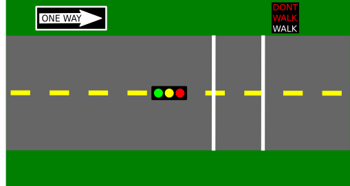
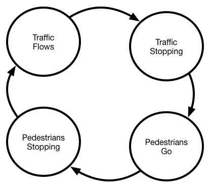



# {{ page.title }}

## Introduction

Click [here]({{ "/tbd.html" | relative_url }}) to access the Canvas page with the repository for this studio.

In previous studios and assignments you have already explored the `delay()` function. Many applications rely on precise control of timing and strictly relying on `delay()` suffers from a few problems:

 * It's blocking.  That is, it doesn't complete until the given time has elapsed, and, consequently, blocks almost all activity for the duration of the delay. 
 * It's difficult to do precise timing with `delay()`.  `delay()` causes a specific delay, but it doesn't take into account the time taken by other instructions.  Therefore including a `delay(100)` isn't usually sufficient to ensure a delay of precisely 100ms.

Today we will explore this concept further and introduce a workaround to the problems with delay-based timing.

In order to practice the concept you will create a controller for an intersection with a pedestrian crossing. 

### Objectives

By the end of this studio, you should know:

- how to write **delta-based timing** software and
- how to **asynchronously control multiple outputs**.

## Hooking up a stoplight

The first step in programming an intersection is building a model of the intersection. Start with an intersection that will enable automobile traffic to go one direction (west to east) on a two-lane, one-way road or allow pedestrians to cross the road (north or south).

### Traffic and Pedestrians

A traditional three color (Red, Yellow, Green) traffic light will control traffic on the road and the pedestrian crossing will be controlled by two lights: a "*DONT WALK*" light, indicating it **isn't** safe to cross, and a "*WALK*" light, indicating it **is** safe to cross. Obviously, when the "*WALK*" is on the traffic light should be red.  When traffic is allowed to move the "*DONT WALK*" light will flash to help catch the attention of pedestrians.

### Setup
 
Wire up the intersection by hooking up 5 LEDs to your Arduino: one traffic lights (red, yellow, and green LEDs), and one pedestrian "WALK" indicator ("WALK" and "DONT WALK" LEDs, any color). If you wish, it is fine to use your RGB LED as the "WALK"/"DONT WALK" indicator, but it should use two different colors. 

**NOTE:**
Your first inclination might be to start at pin 0, then work up from there as you add pins. This will not work.
Pins 0 and 1 are `RX` and `TX` pins: they are connected to the same parts of your Arduino that handle receiving and transmitting data from the computer. The upshot of this? If you attach a circuit to these pins, uploading probably won't work.
As a result, the convention in Arduino is to wire starting at pin 13 and work down.

Attach each discrete LED to a digital pin, making sure that each's path to ground has a series resistor as indicated in the diagram below:

Any resistor value between 200 ohms and 500 ohms will work fine.
	
Since the LEDs represent different combined components (stoplights and walk signals), grouping them appropriately will help you understand the system better. The layouts shown in the demo videos below show some appropriate approaches.
	 
- Test your connections by using the `LEDTest/LEDTest.ino` sketch in the repository.  Add code so it turns the 5 LEDs on and off. 

## Getting the light to change 

1. Complete the `stoplight.ino` sketch in `stoplight/`. 
2. You know that using `delay()`-based timing is inaccurate. Furthermore, it is a **blocking** procedure: your Arduino literally waits for however long you specify, not running any other code until the delay is completed. 
 
This is not good for our stoplight: we have to time many different states (e.g., green lights take different time than yellow lights) while also maintaining constant flashing on the *DONT WALK* signal. We *could* carefully architect our times so that all the times have a common factor (i.e., the *DONT WALK* flash interval could be a factor of the state duration, so you could measure state changes in "number of flashes"), but there's a better solution that doesn't require such convoluted reasoning.   

### Delta-based timing
	
Delta timing is a **non-blocking** timing mechanism. It does not halt the rest of the program while it waits. It's a powerful concept used in everything from slow computers to the most 	recent blockbuster video games (it's actually [vital to them](http://gafferongames.com/game-physics/fix-your-timestep/)).
	
It is not a specific function, but rather a *mindset*, a different way of reasoning about your programs.  And it all starts with `millis()`. `millis()` returns an `unsigned long` indicating the number of milliseconds that have elapsed since your sketch began running.  Instead of *having your sketch wait* for the right time, you create code that will run *after the appropriate amount of time has passed*.  By keeping track of the `millis()` value of the *last* time you executed a recurring task, you can compare its value to the *current* `millis()` value every iteration of the loop, and if the difference---the **delta**---is larger than a certain value, you execute the task again.
	
For example, if I had a task I wanted to run every second, like in the heartbeat project:

~~~ c
// Create a variable for the "period" (time between beats) in ms
const unsigned long beatPeriod = 1000;     // 1000ms = 1s. 

// Create a variable to keep track of when the last beat occurred
// (The approach here assumes that it happens exactly on schedule
//  it will try to maintain the overall "frequency" of beats)
unsigned long lastBeatTime = 0;

void loop() {

	// Get the current "time"
 	unsigned long now = millis();

 	// Check if it's been too long since the last beat
 	if( (now-lastBeatTime) >= beatPeriod) {
 		// It's past time for a beat --- do it
		Serial.print("beat");

		// Schedule when this beat should have occurred.
 		lastBeatTime = lastBeatTime + beatPeriod;
 	}
 } 
~~~

Because there's no delay, the `if` statement does not block program execution.  If a program needs to do several tasks at regular intervals (but possibly having different frequencies), it could use one variable to keep track of the "last beat" for each task.

Another approach to delta timing would rely on computing when something should happen and then executing code at or a little after the appropriate time has passed.  For example:

~~~ c
// Create a variable for the "period" (time between beats) in ms
const unsigned long beatPeriod = 1000;     // 1000ms = 1s. 

// Create a variable to keep track of when the next beat should occur
// (The approach here tries to maintain a fixed minimum period
//  between beats at the expense of an accurate frequency)
unsigned long nextBeatTime = 0;

void loop() {

	// Get the current "time"
 	unsigned long now = millis();

 	// Check if it's been too long since the last beat
 	if( (now >= nextBeatTime) {
 		// It's past time for a beat --- do it
		Serial.print("beat");

		// Schedule when the next beat should occur.
 		nextBeatTime = now + beatPeriod;
 	}
 } 
~~~

This approach also avoids the use of `delay` and is basing its actions on the difference ("delta") in times between events.  Either approach is sufficient for most low speed applications where an accurate frequency isn't critical.  Feel free to choose the one that either seems best for a particular task or that you are most comfortable with.

### Delta-timed FSMs
	
Start by using a delta time loop to make your stoplight change and control the traffic light appropriately (*ignore the pedestrians for the moment*). You will need to use a global variable to keep track of the state of your intersection and another as the accumulator. We recommend using a FSM to keep track of the "state". 
		
Now let's consider the different states of our stop light system. The different phases an intersection has: the light is green, then it is yellow, then it is red and pedestrians can cross, then the light is still red but pedestrians can't cross, and finally it starts over again with a green light for traffic. You can reduce the system down to four different intervals. A **finite state machine** will make your program *significantly* easier to reason about.  It will look something like this:

	
| State              | Stoplight | Pedestrian Light
-------------------- | --------- | --------------- 
Traffic Flows        | Green     | Don't walk (flashing)
Traffic Stopping     | Yellow    | Don't walk (flashing)
Pedestrians Go       | Red       | Walk
Pedestrians Stopping | Red       | Don't walk (flashing)
		
In the FSM above, what triggers the transition from one state to the next state?

Use `const unsigned long`s at the start of your program to define the time intervals for each state in milliseconds. 

To underscore our point about the flexibility of this approach to timing, choose a prime number for at least one of the traffic intervals, like `3041`.  The only possible common factor between this period and that of other states is 1 (1ms). The Arduion's `millis()` can't reliabliy time things at the millisecond level, so this period could *not* be handled without delta timing.

If you successfully implement a FSM, your `loop()` should become a two or three step process:

- calculate new state
- output traffic signal LEDs based on state
- independently flash walk signal

Since the code for each process is fairly long, separate each phase into a different function. This will make your program simpler to understand and explain.
	
### Just add pedestrians

Because a delta time loop does not block, you can have other timers running at the same time, even if they have very ugly common factors. For example, strategy games update the game state very rarely (maybe 7 Hz) but redraw the screen very frequently (60 Hz). They may just have two delta time loops, one for game state and one for screen state.

Add another delta time segment to your program to flash the walk signals appropriately. When the road is crossable, the walk LED (probably a green one?) should be on, and when the road is not crossable the don't walk LED (probably a red one?) should be flashing. 

## Demo

The top three LEDs represent the traffic light and the bottom two LEDs are the *WALK*/*DONT WALK* signals. *WALK* is blue and  *DONT WALK* is red.

<iframe src="https://wustl.app.box.com/embed/s/6payghilkn23ti6vysjpmipiwxoqn3uy" width="500" height="400" frameborder="0" allowfullscreen webkitallowfullscreen msallowfullscreen></iframe> 

Note that:
- the Yellow light is shorter than Green or Red lights
- the *DONT WALK* indicator blinks consistently 

## Finish up

1. Commit your code and get checked out. 

Changes to repo structure:

- `stoplight/`
   - `stoplight.ino`
- `LEDtest/`
   - `LEDtest.ino`


