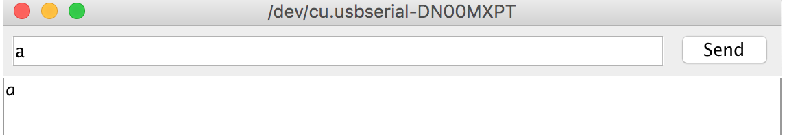
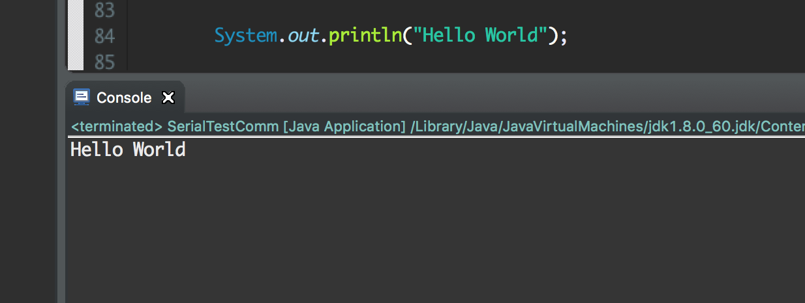



# {{ page.title }}

## Introduction

Click [here]({{ "/tbd.html" | relative_url }}) to access the Canvas page with the repository for this studio.

## Objectives

By the end of studio, you should know:

- how to **read from the Arduino's Serial Port**, 
- how to **convert from Hexadecimal to Binary**, and
- how to differentiate between
	-  **Hex** `a` and **ASCII** `a`
	-  **int** `0` and **ASCII** `0`.
- how to **receive user input in Java on your computer**,
- how to **write to the Serial Port in Java on your computer**, 
- how to **read from the Serial Port in Java on your computer** 

## Today's studio

Today you will be reading a [Nibble (also spelled "Nybble")](https://en.wikipedia.org/wiki/Nibble), which is one hexadecimal digit, from your keyboard and displaying it on your Arduino using 4 LEDs to represent the bits of the nibble. So you should be able to type 0-9 and a-f on your computer and see the binary representation show up on the LEDs.

## Background

### Recap on Hexadecimal 

 DEC | HEX | BIN
 --- | --- | --- 
0  | 0 | 0000 |
... | ... | ...|
9  | 9 | 1001 | 
10 | a | 1010 | 
11 | b | 1011 | 
12 | c | 1100 | 
13 | d | 1101 | 
14 | e | 1110 | 
15 | f | 1111 | 

*Why Hexadecimal?* --- Humanizing Binary

Most common data types require many binary digits. For example, a Java `int` is 32-bits wide and uses Two's Complement.  In binary, a -12 would look like  11111111111111111111111111110100, which isn't very easy to read.  (Can you quickly tell if it even has 32 bits?)  Since each digit of hexadecimal corresponds to exactly 4 bits of binary, we can break this down into just 8 hex digits: 0xFFFFFFF4, which is much easier to work with.  Since it's easier to read and can still be used to quickly find the value of a particular bit, hexadecimal is often used rather than binary.

Notice that the conversion from hexadecimal to binary (or from binary to hexadecimal) is like a simple [substitution cipher](https://en.wikipedia.org/wiki/Substitution_cipher).  Given a number like: 11111111111111111111111111110100 you:
1. Break it into groups of 4 bits: 1111 1111 1111 1111 1111 1111 1111 0100
2. Look up each group of 4 bits in the table and substitute it with the corresponding hexadecimal digit: F F F F F F F 4

If you wanted to convert hex to binary you just use the table in reverse.  You'd look up each hexadecimal digit and replace it with the corresponding four binary digits.

## The Arduino End

An empty Arduino sketch has been created in `CSE132-studio4 > HexLEDs > HexLEDs.ino`. Use it for your Arduino work.

Start by assuming the User's Input will be sent to the Arduino via the serial port. We can use the Serial Monitor window to emulate the values that will eventually be coming from a Java program on the computer. Notice the text field that can be used for input, like the 'a' that is entered here:

In this example the Arduino program has "echoed" the value back to the Serial Monitor.

### Reading from Serial Port

We will be using [`Serial.available()`](https://www.arduino.cc/en/Serial/Available) and [`Serial.read()`](https://www.arduino.cc/en/Serial/Read) to read from the serial port. 

To Echo Data like in the above example:

- check to see if there are *available* bytes to read

        if(Serial.available() > 0) {
        
- *read* available bytes into an appropriate variable

        	myVar = Serial.read()

- *print* back to the Serial Monitor

        	Serial.println(myVar) 
        }

Complete a sketch using the above to merely "echo" whatever characters you type in the input prompt of the Serial Monitor.  Test it to be sure you are reading data correctly.

Note: For all **Serial Port** Matters this [**reference**](https://www.arduino.cc/en/Reference/Serial) is your friend. 

### Displaying on LEDs

Once you can successfully echo back the input using the serial monitor:

1. Build a circuit that includes four LEDs.  Suggested components:
	- 4 LEDs (any color)
	- 4 resistors		
	- 5 wires
1. Update the sketch to test the four LEDs and run it.
1. Update the sketch to display the appropriate binary value.   Note that the input will be an [ASCII](http://www.ascii-code.com/) character, which won't correspond to the binary representation of a hexadecimal digit. You'll have to use some code to convert or interpret the meaning of the ASCII value correctly. 
 
#### Converting ASCII to Binary

Update your sketch to use an `int` variable to store the result from `Serial.read()` and print the value.  Test your code.  What does it print when you enter a '0'?  

ASCII is also like a simple [substitution cipher](https://en.wikipedia.org/wiki/Substitution_cipher), where each symbol is replaced by a numeric value. This [ASCII table](http://www.ascii-code.com/) shows symbols in the center column and the decimal value that is substituted for it in the left column.  For example, the character '0' is represented by the decimal value of 48 (or 0x30 if we use hex). When the computer sends a '0' (a character) it's really sending the equivalent of 48 (decimal).  

The order and values assigned in the ASCII table weren't chosen at random.  There are several things that are particularly convenient about the orders and values of symbols in the table:

- The "differences" between lower and upper case.  In binary, how different is an 'A' from an 'a'?  What about a 'B' from a 'b'? If you notice a pattern you may realize that there's an easy way to convert from one case to another using bitwise operations. There's also an easy way to "ignore case" using bitwise operations. 
- The "difference" between digits.  How much difference is there between the decimal value of '0' and the decimal value of '9'?  What would happen if you take the decimal value of '5' and subtract the decimal value of '0'?  There's a pattern here that can make conversions of characters to corresponding decimal digits easy. A similar trick can be used with the a-f characters used in hexadecimal. 

Complete code that will convert the ASCII value into an appropriate decimal value (that is, an 'a' should become the decimal value 10, a '7' should be the decimal value of 7, etc.).  (For a challenge, try to accomplish this in four or fewer simple lines of code)

## Writing to the Serial Port

1.  `CSE132-studio4 > communication` contains a partially complete Java class named `SerialComm`.  It has some `TODO` items that need to be completed.  If you're confused about the purpose of this class, we have written a [SerialComm]({{ "/SerialCommGuide.html" | relative_url }}) guide to better explain it.

2. This program will send data via the serial port (to your Arduino). In order to do that, you will need to use the `SerialPort` class---that is available as a library, the JavaDoc is available [here](https://classes.cec.wustl.edu/~SEAS-SVC-CSE132/jssc/javadoc/)---and connect to the correct port.

The `SerialPort` methods might `throw` an `Exception`. For example, the port you provide could not exist, or your drivers could be set improperly. When code you write calls other code that might do this, you have two options: pass the exception up for someone else to deal with (by specifying that your function `throws` an exception sometimes, or handle it yourself using a [`try`-`catch` block](https://docs.oracle.com/javase/tutorial/essential/exceptions/catch.html). Eclipse will help you write one.

Note the constructor code sets the **baud rate** (feel free to leave it at the current `9600` baud), the rate at which your serial expects data from your Arduino.

Add a new `writeByte()` method to `SerialComm`. It can simply use the `writeByte()` method of `SerialPort`. Your `writeByte()` should also have a debugging capability.  When `debug` is `true`, `writeBtye()` should both send the byte to the serial port (using `SerialPort`'s `writeByte()`) *and* display it (in hex) on the console.  Use the format `<0xff>`, where `ff` is the hex value.  In this way, displayed hex values in `[]` are input bytes and hex values in `<>` are output bytes (from the perspective of the Java program). Note, we'll add the capability to handle input bytes below, for now just worry about the output bytes.

**Warnings**

We are using a recently updated version of the serial port library, and it has an issue where it gives a warning about missing logs (when you run your Java program).  You may ignore this warning.

**Resolving problems on a Mac**
	
If you are on a Mac and you are having problems, try the following:
	
	Open up Terminal (oh boy)
	Type `sudo mkdir /var/lock` (without the quotes) and press enter.
	Type `sudo chmod go+rwx /var/lock` (without the quotes) and press enter.
	Communication should work now

**`PortInUseException`**

Make sure you've closed all your Java programs with the Terminate button in the console. Make sure you've closed Serial Monitor. Make sure you've run the Terminal commands in the list above.
	 
**`PortNotFoundException`**

See what `SerialPort` is connecting to— it should match the port name in the Arduino IDE (`/dev/cu.usbmodem0000` or something similar on Macs, COM1, COM2, or something similar on PCs).

<!-- <aside class="sidenote"> -->
>#### Startup debugging

>You can only have one open connection to your Arduino at any given time, be it
>uploading new code, Serial Monitor, or a custom Java app.

>So make sure to close all your Java programs after running them.

>1. Click the red square on the side of the Java `Console` to stop the program.
>2. Click the `x` next to it to clear that program's output and show any other running programs (if there are)
>3. Repeat for all open programs.

>Also close Serial Monitor when you are not using it.
<!-- </aside> -->
	

### Get User Input

Open the `HexTX.java` (in the `communication` package). 

Now that the Arduino is setup to receive user input you need to prepare a Java program to get user input and transmit it to the Arduino. For this studio we will be using the *Console* panel in Eclipse.

You might have noticed the console is where all of your `System.out.print()`s are sent:

 
Input can also be entered at the Console:

- Instead of `System.out` we use `System.in`.
- Like most [Streams](https://docs.oracle.com/javase/tutorial/essential/io/streams.html) in Java, `System.in` can be **wrapped** for increased usability, and performance. 
- Take a look at [`InputStreamReaders`](https://docs.oracle.com/javase/7/docs/api/java/io/InputStreamReader.html) , [`BufferedReaders`](https://docs.oracle.com/javase/7/docs/api/java/io/BufferedReader.html) , and [`Scanners`](https://docs.oracle.com/javase/7/docs/api/java/util/Scanner.html) to see which wrapper(s) you want to use.  You may have code that looks something like:
~~~ java
Wrapper sys = new Wrapper( new innerWrapper(System.in));
~~~	    
- Try to "echo" the user input (print what you receive), like:
~~~ java
System.out.print(sys.read());
~~~		
- Run your Java Program to see if "echos" the input typed into the console pane in Eclipse.
- You might be wondering why you'd use wrappers? This [StackOverFlow response](http://stackoverflow.com/questions/15984789/what-exactly-does-stream-and-buffer-mean-in-java-i-o) has a great explanation. 

#### Never trust User Input / Sanitizing Input 

Now that your program can receive Input, we must be **cautious** before sending to the Arduino.

The LEDs can represent 0-9 , a-f

- What if:
	- the user types "g"
	- the user types "ab"
	- the user types "a03443sadfasd"
	- the user types ""  (I.e., just hits enter without typing anything)

Often user input must be "validated" or "sanitized" to remove undesirable values. Both validation and sanitization are about avoiding undesirable values in the input.  The term validation usually refers to ensuring input is in a valid format and range and sanitization usually means that no "covert" input is included.  Unsanitized input is a prime culprit in many forms of attacks on internet sites (See: [Prevent Web Attacks Using Input Sanitization](http://www.esecurityplanet.com/browser-security/prevent-web-attacks-using-input-sanitization.html), or [Keeping Web Users Safe By Sanitizing Input Data](https://www.smashingmagazine.com/2011/01/keeping-web-users-safe-by-sanitizing-input-data/), or [Bobby Tables](http://xkcd.com/327/) ([Bobby Tables Explained](http://www.explainxkcd.com/wiki/index.php/327))).

Before writing code to validate input you first have to identify what constitutes valid vs. invalid input and then you have to decide how to handle the problem. 

For example, we know that with just 4 LEDs the Arduino can only display 1 Nibble (1 hex digit) at a time.  If the input is longer than 1 character it's invalid, but do you...

- Keep just the first letter or
- Keep just the last letter or
- Ignore everything or
- Raise an error and ask for user input again

Whenever receiving user input try to **predict** what will happen if they don't follow your guidelines and plan appropriate responses.  Planning responses to invalid input can avoid many run-time errors. 

Next, send valid input from the console to the Arduino, and then prompt the user for additional input (i.e., put the prompt to the user and the sending of the input to the Arduino in a loop).  Be careful how you take a `char` type and send only a `byte`.  They are *not* the same thing in Java.

## Switching things up 

Now that you've successfully sent data from Java to you Arduino, it's time to send data back the other way from you Arduino to a Java program in your computer.

### Simple printing

The first task for Arduino to Java communication is to have a Java program receive data sent by the Arduino.
We will start simple.

You may want to refer to the [JavaDoc](http://classes.cec.wustl.edu/~SEAS-SVC-CSE132/jssc/javadoc/) for the jSSC
library, particularly the `SerialPort` class methods.

1.  You will be modifying the `SerialComm` class that you created earlier.  

    Make sure to give it a `static void main()` method if it doesn't already have one.  You will no longer rely on the` HexTx.java`.

    This program will receive data from a serial port (your Arduino) and print it out. In order to do that, you will use additional features of the `SerialPort` class that you were introduced to earlier in the studio.

2. You should author two new methods (in addition to `main`) in your `SerialComm` class: `available()` and `readByte()`.

    The `available()` method should return a `boolean` that is `true` if there is at least one byte available to be read from the serial port.  The `getInputBufferBytesCount()` method of `SerialPort` is helpful here.

    The `readByte()` method should read a single byte from the serial port and return a `byte` that contains the value read.  The `readBytes(int byteCount)` method of `SerialPort` is helpful here, but watch out for its return type (an array of bytes, `byte[]`, rather than a single `byte`).

    In the `main` routine, first create a `new` `SerialComm` object.

    Next, continuously check if a byte is `available()` and read it if there is. Have your program [*infinitely*](http://stackoverflow.com/questions/15989618/java-infinite-loop-convention) do this.

3. Now, take the data you read and find a way to print it to the Java console. Note the return type of `readByte()`. Though in our case it *represents* a `char`, it is not of type `char`, it is of type `byte`. They are not the same thing in Java, a `char` is a 2-byte type. This is a [design choice](http://stackoverflow.com/a/4659801/788168). You will have to cast it to print it properly.

    Using any of your previous Arduino sketches that send data to the Serial Monitor (e.g., `heartbeat.ino` might be a good choice), exercise your Java program and ensure that you get the same text output on the Java console that you previously were getting when using the Serial Monitor built into the Arduino IDE.

4. Experiment by starting the Java program first, then the Arduino. You can do this by downloading the Arduino program, running it and testing via the Serial Monitor, closing the Serial Monitor, and pulling the plug on the USB cable to the Arduino.  Start up the Java program, then plug in the Arduino, which will cause it to start again (the sketch is retained in memory that is not lost when the power is removed).

After you've tried that, change the startup order.  What happens when?  Why?

<!-- <aside class="sidenote"> -->
>#### Startup debugging

>You can only have one open connection to your Arduino at any given time, be it uploading new code, Serial Monitor, or a custom Java app.  It's important to:

>1. Make sure to close all your Java programs after running them.
>   1. Click the red square on the side of the Java `Console` to stop the program.
>   2. Click the `x` next to it to clear that program's output and show any other running programs (if there are)
>   3. Repeat for all open programs.
>2. Close Serial Monitor when you are not using it.
<!-- </aside> -->

### A debugging version

Recall from above that there was a debug option that could be used to examine outgoing bytes from Java to the Arduino. We wish to replicate this behavior for bytes going from the Arduino to Java.

Reimplement the `readByte()` method you made earlier so that it conditionally (based upon the value of the `debug` instance variable) prints incoming bytes to the console in hex.  When `debug` is `true`, you will need to convert to hex before you print: for every byte that comes from the Arduino, the debugging output should be 6 characters: the string "[0x", 2 characters that represent the data byte in hexadecimal, and the character ']' (e.g., if the byte in the data stream is `5f`, the string sent to the console should be "`[0x5f]`" (or "`[0x5F]`" if you prefer).  You can use `String.format("%02x", byte value)` to format a `byte` as a two-character `String` in hexadecimal.

It should continue to return the value of the byte that was input from the serial port.

You should now be able to view the data in hex as it goes through the `readByte()` method *and* be able to view the "true" ASCII value in the Java console.

## Finishing up

Check out and get out.

1. Make sure to *commit* your workspace

    In Eclipse's package explorer, any files you have modified since your last commit are prefixed with a `>`.
	
    Right-click the outer-most folder (you want to commit *everything* within), and choose `Team>Commit...`. Write a helpful message and press `OK`.
	
    You can verify that your changes went to the server by opening the repository URL in any web browser. 

2. Get checked out. You don't need a TA for this, instead each member of the group should separately take the [quiz](https://wustl.instructure.com/courses/58988/quizzes/49429) (also available through Canvas).

Repository structure for this lab:

<!-- <section class="tree"> -->
- `communication/`
  - `HexTX.java`
  - `SerialComm.java`
- `HexLEDs/`
  - `HexLEDs.ino`
<!-- </section> -->

## Key Concepts

This is a mental checklist for you to see what the Studio is designed to teach you.

- Java program 
	- Acceptable User Input
		- 1-9 , a-f
		- displays an error message for invalid input and does **not** pass invalid input to the Arduino.
	- Writing to the Serial port
		- `writeByte()`
	- Reading from the Serial port
		- `available()`
		- `readByte()`
- Arduino Program 
	- Reading from Serial port
		- `available()`
		- `read()`
	- Convert ASCII to Binary for the corresponding value
	- Display 4-bit Binary with 4 LEDs
