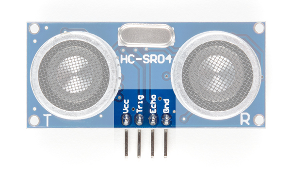



# {{ page.title }}

## Introduction

Click [here](https://wustl.instructure.com/courses/68860/assignments/289457) to access the Canvas page with the repository for this studio.

### Objectives

The topic of today's studio is receiving data in a
Java program and familiarizing yourself with a new input sensor (a sonic echo transucer to measure distance).
Both of these will be essential elements of the assignment.

By the end of this studio you should know:

- how to send and receive data types that are larger than a single byte.
- how to interact with the sonic distance sensor.

## The Studio

1. All of the data we've been transmitting so far has been ASCII characters. While it is very possible to communicate entirely using ASCII characters, it is very inefficient. In other words, you *could* convert your `3` to the ASCII character for `3` (`0x33`) and convert it back upon receipt, but that just seems silly. However, that's what happens when you use `Serial.print()`, or, in general, any "print" method: the program converts whatever you want to print *from* it's internal representation *into* a printable representation, like an ASCII character, then sends that to an output stream.

	If you *actually* want to send a `3`, not `0x33`, over a stream, you use `Serial.write()`. From [the documentation for `Serial.write()`](https://www.arduino.cc/en/Serial/Write), it's clear that it can only send one byte at a time: it can only physically send numbers between `0x0` and `0xff`. Anything more than that is truncated: `301` (`0x012d`) is sent as `45` (`0x002d`).

	Make a new Arduino sketch (named `datatypetest.ino` that first `Serial.write()`s then `Serial.print()`s the numbers `0` through `360` in sequence. What are the results when you use your Java program to view the output? What about Serial Monitor? Use a list of ASCII characters (available on the internet or via the command `man 7 ascii` in terminal) to understand the output if it's confusing, and remember that an Arduino sketch needs to `Serial.begin(9600)` before it can use any of the serial commands.

2. The Arduino is unable to `Serial.write()` numbers larger than `255`. This is a serious limitation for those of you who enjoy counting. 

	Let's investigate how to send larger (more than one byte) data types.
An integer (an `int`) in Arduino C is a two-byte type. By bitshifting appropriately, you can send each byte of this number *sequentially*. For example, you can send the number `0x4d21` as `0x4d` and `0x21`. Alter this Arduino sketch to send the two bytes in this way, first the **most significant byte** (`0x4d` in the example), then the **least significant byte**.

	Alter `SerialComm`'s `main` routine to combine the two received bytes and store the result
in a Java integer. You will have to bitshift. Remember, Java's integers are 4 bytes, so there is plenty of space for a two byte number to fit[^negative].

	Output the received integers on the console, and compare that with what you see from `readByte`'s debug output.

3. Extend the Arduino C code to send an Arduino `unsigned long int` of 4 bytes (the return value from
`millis()` would be a good choice).  On the Java side, pull the same trick you did for the two-byte values above, just extend it to 4 bytes.
How well does that work?

[^negative]: This size difference actually has a large impact when dealing with negative numbers, which, in both systems, are stored in two's complement. Since a number's negativity is entirely dependent on its first bit, naively sending the Arduino `int` bytes to Java will not correctly send a negative number. 

	The solution is **sign extension**. Bitshifting right in Java (and on signed values in C) automatically copies the highest bit in all the extended places (`0xff00 >> 16 == 0xffff`, `0x0d00 >> 4 == 0x00d0`). This preserves the value of the number, though that exact proof is left as an excercise for the reader.

### Measuring distance

To measure distance, we will take advantage of the fact that the velocity of sound is reasonably fixed (OK, it changes a bit with humidity and temperature, but we're going to ignore those effects) at 343 m/s. Therefore, if we send a chirp of sound from our sensor, wait for the chirp to reflect off some object in front of us, and measure the time until it returns, we can convert that time signal into a distance.  Note, this is a linear conversion operation that is quite similar, in principle, to what we've previously done with the temperature sensor. This implies that the expression for distance (as a function of time), can be expressed in the form

*d = m &middot; t*

where *d* is the distance (in cm), *t* is the time (in &mu;s), and *m* is the conversion factor (in units of cm/&mu;s). What is the value of *m* in this expression so that the units work?  *Note, don't just copy the SparkFun tutorial's code, they are not using cm to measure distance!*

Notice all we've done so far is measure the distance that the sound has travelled.  If we want to measure the distance from our sensor to the object that reflected the chirp, we have to account for the fact that the sound traveled both there and back.  The distance to the object is one-half the distance that the sound travelled.
We can take care of this in one of two ways (which are equivalent): (1) change the value of *m* to one-half of what we decided above, this gives distance *d* to the reflecting object; or (2) after computing *d* as the distance that the sound has travelled, simply divide it by 2 to get the distance to the object.

To actually make our distance measurements, we will use an ultrasonic transducer that operates at 40 KHz, well above our ability to hear (although your dog might not appreciate it in operation, human hearing doesn't really go much above 20 kHz).

Here is an illustration of the sensor that identifies the pins:

The following table describes the function of each pin on the distance sensor:

|Pin	|Description |
|:--------|:--------------------------------|
|VCC	|Power (5V) |
|Trig	|Trigger Pulse Input: Sends bursts of ultrasound at 40 kHz. |
|Echo	|Echo Pulse Output: Receives echo signal. Range is calculated by the proportion of trigger signal sent and echo signal received. |
|GND	|Ground (0V) |

Be careful when wiring up the sensor, as inadvertently mixing up `VCC` (5V) and `GND` (0V) can damage the sensor.  The `Trig` and `Echo` pins can be wired to any convenient digital pin (`Trig` will be a digital output and `Echo` will be a digital input).

When you're not actively using the sensor, please unplug the Arduino. This helps eliminate interference with other groups.

In the Arduino sketch `echo.ino`, set the `trigPin` and `echoPin` pin numbers to correspond to how you wired up your sensor. Insert code to compute `calculatedDistance` using `echoTime` in the `getDistance()` function. Execute the code and monitor the output using the Arduino IDE's Serial Monitor (we'll save sending this information to Java for the assignment).

Put an object (e.g., book, folder, something reasonbly flat that will echo sound well) in front of your sensor and see how well it works.

Check out the code in `getDistance()`, do you understand what it is doing? If not, this is a good question for a TA.

## Finish up

1. Commit your code and verify in your web browser that it is all there.
2. Get checked out by a TA.

Changes to repo structure:

- `communication/`
	- `SerialComm.java`
- `datatypetest/`
	- `datatypetest.ino`
-  `echo/`
	-  `echo.ino`

## Key Concepts

- Serial communication
	- Sending bytes from Arduino to Java (`Serial.write`)
- Java Input
	- Reading serial bytes
- Serial.print()` vs `Serial.write()`
	- conversion and communication efficiency 
- Multi-byte communication
	- byte significance i.e. most significant byte
	- sequencing 
- Measuring distance by timing an echo


