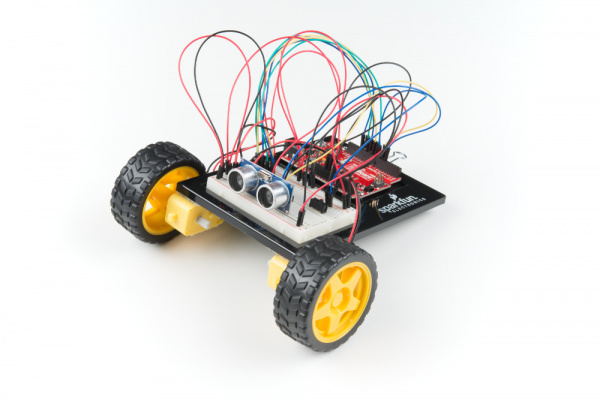



# {{ page.title }}

Click [here](https://wustl.instructure.com/courses/68860/assignments/289482) to access the Canvas page with the repository for this assignment.

## The idea

Over the past few studios, we have constructed all the physical elements of a robotic car.  In this assignment, we will explore ways to control the car in an automated fashion, exploiting the ultrasonic distance sensor to impact velocity.  We will depart from writing Java (the software for this assignment is all in Arduino C), and the focus will be more on understanding the properties of sensor inputs and how they can be used to make control decisions that are implemented via analog outputs.

## The physical car

You have already built all of the physical elements of the robotic car in previous studios.  Here, we will combine the car from this module's studio with the ultrasonic sensor from the earlier studio. An image of the completed car is below.

Note that this looks very close to the image from studio, but has the ultrasonic distance center included as well.
Instructions for the physical construction are on SparkFun's [tutorial](https://learn.sparkfun.com/tutorials/sparkfun-inventors-kit-experiment-guide---v41/circuit-5c-autonomous-robot), but you don't need to add the battery pack (it can be powered directily from the USB on your laptop as we've done all semester).

Before you get started on the actual assignment, it is a very good idea to check out the components that you've already exercised.  Using software from the studios, put the ultrasonic distance sensor and the car through their paces, making sure they each individually operate as intended.

 
## The assignment

Starting from the `AutonomousRobot.ino` sketch in your repository (this one also came straight from SparkFun, with the units changed from `in` to `cm`), adjust the pin numbers (if needed), add your studio code to convert time to distance (in cm), and play with the robot to make sure it does what is advertised.

As we did in studio, when you're not actively using the ultrasonic sensor, please unplug the Arduino. This helps eliminate interference with other groups.

1. Alter the sketch so that instead of responding to an instantaneous distance reading, it first computes an averaging filter of the distance readings (similar to the temperature reading average earlier this semester) and responds to the average.

2. When the switch is `off` and the robot is not moving, display both the instantaneous readings and the average readings in a form that can be plotted using the Serial Plot utility on the Arduino IDE. 

3. We will progressively alter the initial code to exclusively use delta timing rather than `delay()`. Let's start by removing the `delay(50)` at the bottom of `loop()` and replacing it with delta timing code that reads the distance 5 times per second when the switch is `off` (Don't worry about the timing when the switch is on, we'll come back to that later.)  Expand your output print statements to both compute a speed (in cm/s) and plot it along with the instantaneous and average distance readings.  The speed value should be computed from the averaged distance values.  Simply subtracting two distance values that were computed at 1 second intervals allows you to avoid having to do the actual division. Feel free to scale the speed value so that it fits reasonably on the same plot vertical scale as the two distance values.

4. Remove the movement functionality provided by SparkFun (when the switch is `on`) and replace it with the following.  When the distance is greater than 30 cm, the car should move forward at max speed (essentially the speed it was moving at in the previous exercises, this can include adjustments to help keep it going straight).  When the distance is lower than 30 cm, the car should gradually slow down until it stops at a distance 10 cm from the obstruction.

	This functionality is to be designed using delta timing. Continue to read the distance at a rate of 5 times per second, independent of the motion of the car. The gradual slowdown can either be in discrete steps or a linear rampdown, as long as the car perceptively moves slower as it gets closer to the destination.

4. Alter your display code so that instantaneous distance, averaged distance, and speed are displayed when the switch is in either position.

### Guidelines

1. Try to develop an intuition for the noise properties of the distance signal.  Does the averaging help?  What impact would it have on the speed computation if we have a very noisy distance value?

2. Feel free to use print statements liberally in your code when getting the functionality to work.  Then supress those statements and just plot the instantaneous distance, filtered distance, and speed when demoing.

## The check-in

1. Commit all your code.
2. Check out with a TA.


