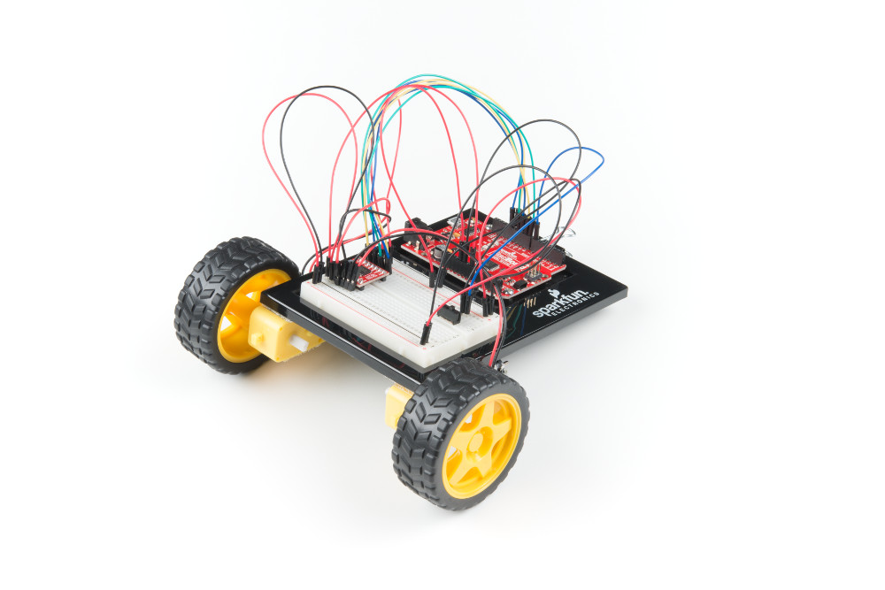



# {{ page.title }}

## Introduction

Click [here](https://wustl.instructure.com/courses/68860/assignments/289486) to access the Canvas page with the repository for this studio.

### Objectives

The topic of today's studio is to experiment with controlling something in the physical world. We will start with controlling a motor, and then use a pair of motors to control a semi-autonomous car.

By the end of this studio you should know:

- how to control an analog output.

## The Studio

We will start by following the instructions provided by SparkFun in their [Motor Basics tutorial](https://learn.sparkfun.com/tutorials/sparkfun-inventors-kit-experiment-guide---v41/circuit-5a-motor-basics). If you position the motor driver as indicated in the tutorial, that will leave space for the ultrasonic sensor (which will be used in the assignment). The sketch is available in your repo for this studio under the name `MotorBasics`.

Notice how different speeds are delivered to the motor via the `analogWrite()` method. Let's explore how that works in a little more detail. In Chapter 4 of the [text]({{ "/files/cc_v0_06.pdf#page=33" | relative_url }}), a pulse width modulated (PWM) output is really just a digital output that cycles between low voltage (e.g., 0V) and high voltage (e.g., 5V) frequently enough that we perceive the average value rather than the instantaneous value. The fraction of the time that the output is high will determine the average value.
The three figures below illustrate a PWM analog output at 10% of full scale, 50% of full scale, and 90% of full scale.

**FIMXE: insert pictures.**

The current requirements of our motor are such that we cannot drive the motor directly from the PWM output pins on the Arduino. Instead, we need to use the motor driver chip. However, the concept is exactly the same.  The motor driver chip is simply increasing the current capability to drive the motor.

### Build a Car

Our next task is to use the motors (two of them) to drive the wheels of a car.  OK, not a very big car, but a mobile device that can move on its own.  Here is a picture of what it will look like:

SparkFun's [Remote Controlled Robot tutorial](https://learn.sparkfun.com/tutorials/sparkfun-inventors-kit-experiment-guide---v41/circuit-5b-remote-controlled-robot) shows how to do the physical construction.
The sketch is available in your repo for this studio under the name `RemoteControlRobot`.

Experiment with the various controls that the provided sketch supports.  We will use this robot (combined with the ultrasonic sensor from previous studio) in the assignment.

## Finish up

1. Commit your code and verify in your web browser that it is all there.
2. Get checked out by a TA.

Changes to repo structure:

- `MotorBasics/`
	- `MotorBasics.ino`
- `RemoteControlRobot/`
	- `RemoteControlRobot.ino`

## Key Concepts

- Analog Output
	- Pulse Width Modulation (PWM)


