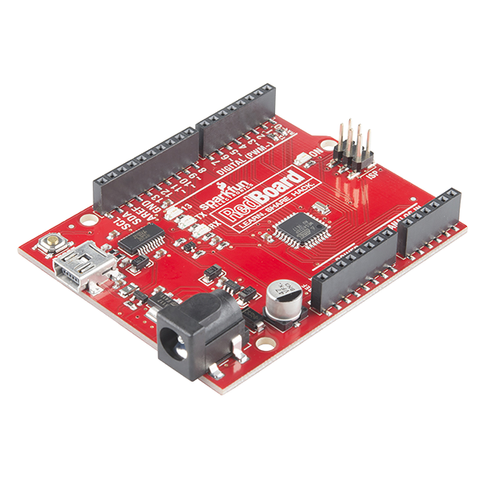
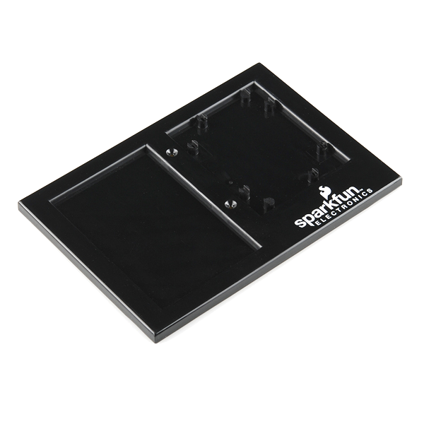
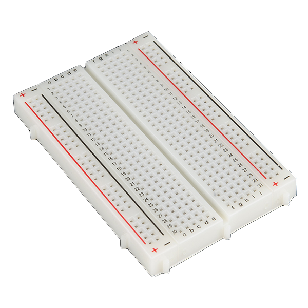
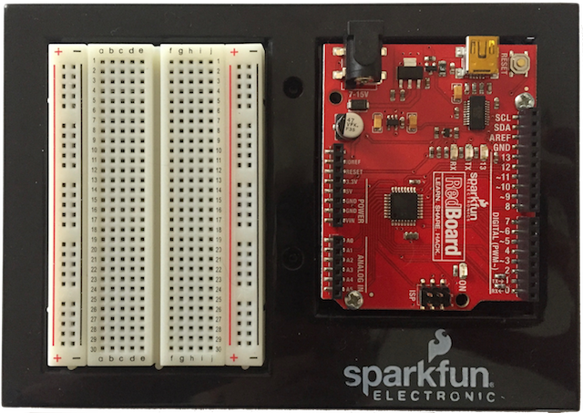
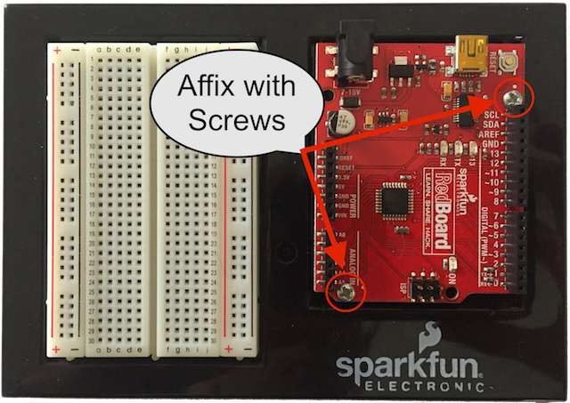
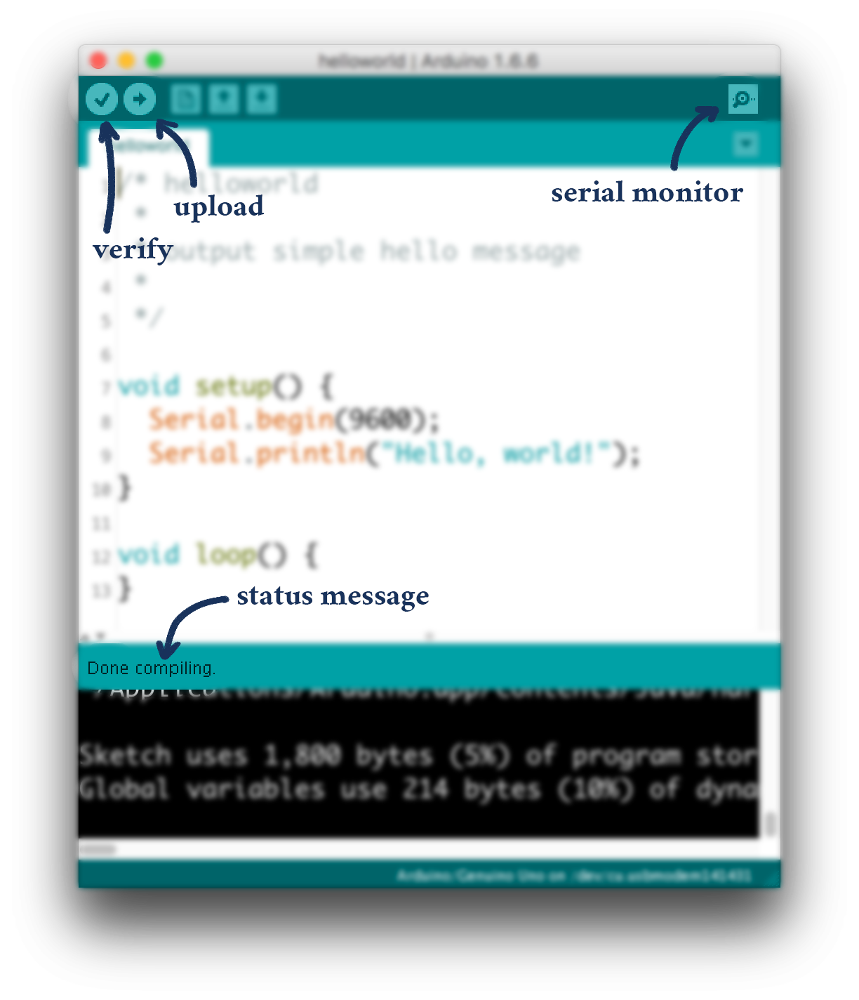
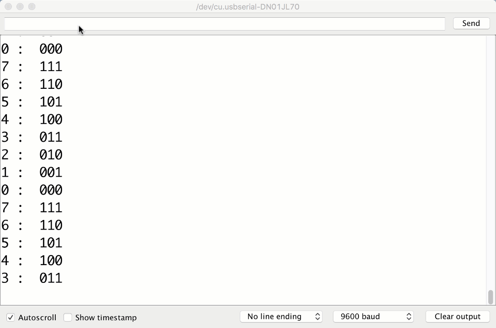



# {{ page.title }}

The files for today's workshop are made available on a thumb drive.  Copy all of the material under the `Arduino` directory into the `Arduino` directory on your laptop.

## Introduction to Arduino

The Arduino is a (very) small computer that has dramatically fewer capabilities than the desktop or laptop machines that you have used in the past to run Java programs. For example, it doesn\'t have a keyboard, it doesn\'t have a screen, its processor is well over 100 times slower, and you might even be wondering, "what is the point?" The point is that small computers like the Arduino are priced relative to their capabilities. Want a computer for under \$10? If so, the Arduino is a great choice! Its small size makes it incredibly useful for lots of jobs where it would seem overkill to use a $1500 laptop.

### Assembling the Arduino Board

You will need to assemble the main components of your Arduino kit. The tutorial from SparkFun (the supplier of the hardware) is [here](https://learn.sparkfun.com/tutorials/sparkfun-inventors-kit-experiment-guide---v41/baseplate-assembly), or you can follow the description below. Either gets you to the same place.

The Arduino RedBoard:

The BreadboardHolder:

And the (solderless) Breadboard: 

When done, it should look like: 

You will need to:
1. Attach the Breadboard to the Breadboard holder *with the labels on the breadboard facing the correct way, as shown above*.  The breadboard has an adhesive backing.  Remove the protective layer and stick it to the holder in the indentation. The column letters a-j on the top and bottom of the breadboard should be in the same direction as the "sparkfun" label on the breadboard holder.   

2. Put the RedBoard on the Breadboard Holder. Again, the print/labels should match those shown above.  The Redboard has four holes for screws and the kit includes two screws.  Any two holes will be suitable, but diagonal holes are recommended.  Screwdrivers are available from the instructors and TAs.

### Programming the Arduino

Although the Arduino itself is a computer separate from your laptop or desktop, its lack of screen serves as an impediment to programming it directly. We write and compile programs for it on a larger computer and then send them over to the Arduino via USB. The Arduino, as you'll soon see, runs one program at a time, for as long as it's plugged in.

As you might imagine, the transfer process is very complex, and until the Arduino came out in 2005, microprocessor programming was a [long and arduous task](http://ww1.microchip.com/downloads/en/appnotes/atmel-0943-in-system-programming_applicationnote_avr910.pdf). Luckily for us, we are past those dark ages of computing and we have the **Arduino IDE** (Integrated Development Environment). The Arduino IDE helps you write and compile Arduino programs and also manages uploading those programs to your Arduino board.

Arduino programs are written in a variant of C, one with extra libraries specifically for writing Arduino programs. If you have already been introduced to C, programming the Arduino should be a snap.

## First Exercise

In this exercise you will get accustomed to the basics of Arduino C by observing a simple "helloworld" program and uploading it to your Arduino board.

### Running a program

Navigate to the `helloworld / helloworld.ino` file underneath your `Arduino` directory. Double click on the file to start the Arduino IDE.

The `helloworld.ino` file is a complete Arduino program. Compiling and uploading it should help you learn the Arduino interface.

1. Click the **Upload** button to *compile* `helloworld` and *upload* it to the Arduino (the **Verify** button just compiles your program, looking for errors in the code).
2.	Make sure the code uploaded correctly (the **status message** should say `Done uploading.`).
3. Open the **Serial Monitor** to view the output that our newly programmed Arduino writes to its *serial port*. You should see the phrase `Hello, world!`.
4. Press the **reset button** on your Arduino board. The Serial Monitor should  display the phrase `Hello, world!` again.  **Important:** Note that in the bottom right of the Serial Monitor there is a dropdown box that by default reads `Newline`. **Change this to the `No line ending` option**. This has to do with input to the Arduino from the keyboard. Although this first exercise will not provide keyboard input to the Arduino, future exercises will, and it is important that the `No line ending` option is selected or unintended issues may arise. You should get into the habit of making sure this option is selected.
5. The Arduino has two **entry points** into your code, or, in other words, two places it looks to run your code. Whenever the Arduino starts up or is reset, the Arduino runs the `void setup()` function once. After that, the Arduino runs the `void loop()` function over and over until the Arduino is unplugged or reset.

	Opening serial monitor or pushing the reset button on the Arduino both reset the Arduino.
	
	Note that opening the serial monitor will sometimes print garbage data as the signals between the Arduino and computer sync up.

<!-- <aside class="sidenote"> -->
>#### Problems uploading?

>Considering that you are compiling a program from C, using an old USB driver designed by one company to communicate with a board designed by another company running code designed by a third, it\'s surprising that Arduino upload works as often as it does.

>But stuff goes wrong. A lot. Here\'s how to troubleshoot your upload.

>- **Is your code free of syntax errors?** Make sure that your code is correct (**Verify** it and make sure the status is `Done compiling.`)
>- **Are you writing to the correct port?** Look under `Tools>Port>` and select a different one. On Windows it will be something like `COM3`. On Mac, it will be something like `/dev/cu.usbmodem1492`. There\'s no good way to find the correct one aside from guess-and-check.
>- **Restart the Arduino IDE and plug everything in again**. It works a lot of the time.
<!-- </aside> -->

## Second Exercise

[**Here**]({{ "/intro-to-FSMs.html" | relative_url }}) is a great introduction to Finite-State Machines (FSMs). They are also described in Chapter 7 of the [text]({{ "/files/cc_v0_07.pdf#page=75" | relative_url }}) (read Section 7.1).

For the next exercise in this studio we have provided another program `countFSM.ino`, a simplified binary counter, designed to introduce you to the concepts and syntax of FSMs.

- Open `countFSM.ino` (` countFSM / countFSM.ino`)
- Upload `countFSM.ino` onto the Arduino
- Open the Serial Monitor and notice how the **state** changes with the Binary Counter

Here is a visual depiction of the FSM:

- The **circles** represent the possible states the machine can be in, and each circle has its own set of instructions. 
In the studio example **Case1** would have instructions to print out `1   :   001`.
- The **arrows** represent the possible movements the machine can make.
In the studio example the arrow from **Case1** to **Case2** shows that a movement from *1* to *2* is possible. 
	- This particular FSM can not move backward or even stay in the same state because the arrows only point forward

### Enums

Here is this FSM's `enum`:

	enum State {
		up0,		// 0
		up1,		// 1
		up2,		// 2
		up3,		// 3
		up4,		// 4
		up5,		// 5
		up6,		// 6
		up7,		// 7
	};
	State counterState = up0;

What does *this* output?

	state = up4;
	Serial.print(state);

*Enum* types in C are just **numbers** with readable **names**, and those names are not compiled into your program -- meaning *"up4"* is not accessible at runtime. In other languages, however, Enums sometimes have a `toString()` or `name()` method that will allow access to a **name** at runtime.

An `Enum` is useful when a variable can **only** take **one** out of a small **set** of possible values. Examples include *Months*, *Game Pieces*, or the *Cardinal Directions*. 

A great way to think about these are Drop Down Selection boxes:

](selectBox.png)

There can **only** be **one** selection from **Multiple** Choices

	enum Fruit {
		Banana,
		Apple,
		Mango
	};

	Fruit myFruit = Banana;

	switch(myFruit) {
		case Banana:
			print("Banana Selected");
			break;
		case Apple:
			print("Apple Selected");
			break;
		case Mango:
			print("Mango Selected")
			break;
	}

### Switch Statements: 

`switch` statements are where enums shine.

Here is the Switch statement from the Example:

	switch(state){
		case up0:			//When state up0 , the FSM must:
	
			bit1 = 0;		//set the bits to match the Count
			bit2 = 0;
			bit3 = 0;
		
			pprint(state);

			state = up1;	//Move to the next state		
						//The next loop will go to case up1			
								
			break;			//Break to the end of the switch
						//So the next case won't run too
								
		case up1:			//only if counterState == up1
	
	}

### Advanced FSMs

Here is an example of an FSM that can both switch and remain in its own state depending on the Input:

 
- Input **A** :  stays in own state
- Input **B** :  switches state

Things can can get Confusing Quickly:

## Third Exercise
	
This part has two components: drawing a FSM, and executing said FSM on your Arduino. 

- Connect your Arduino
- Open `updownFSM / updownFSM.ino`  

### Interpreting FSM bubble diagrams

Here is the drawing of the original FSM from above:

- The **circles** represent the possible states the machine can be in, and each circle has its own set of instructions. 
- The **arrows** represent the possible movements the machine can make.
- Notice that this FSM has no inputs. It continuously progresses from one state to the next. This is about to change!

### Drawing Your Model

- Draw a FSM to model a Binary Counter that can reverse directions
	- We want to use an input to dictate when we should reverse directions. For this studio, our input will come from the keyboard. In your FSM drawing, however, you could represent the input as a binary value: 1 if a key has been pressed, and 0 if not.
	- *Hint -- your FSM should have 16 states.* One set of states is for counting up and another set for counting down. If you were to only use 8 states to represent the current number, the FSM does not know whether it should count up or down. We would need another variable to keep track of which way we are counting (which effectively adds additional states to the FSM in a rather crude and unsophisticaed way). 

### Transferring FSMs to code

- Return to `updownFSM.ino`
- Complete the function `determineNextState()`  with a **FSM** to determine the next state of the machine.
	- Using your FSM drawing as a guide, your FSM should have **16** states and a matching `enum`.

Here is an Example of an Enum in Arduino C:
   
	enum Direction {
  	 North,			// North = 0
  	 East,			// East = 1
  	 South,			// South = 2
  	 West			// West = 3
	} direction = North;

 - **Recommended** -- use  `switch`  statements to *switch* between your states using  `cases` 
	- Correctly designed `if` statements will also be accepted

Here is some pseudocode to demonstrate `switch`:

	month = 2
	switch (month) {
		case 1:
			print 'January'
			break
		case 2:  		// switch to case 2 because month == 2
			print 'February' 	
			break		// break so other cases won't run
		case 3:
			print 'March'
			break
		... 
	}

### Adding the Reverse Button

- Complete the function `checkReverse()` , which **reverses** the direction of the counter **if** a key on the keyboard has been pressed.
	- To check if a key on the keyboard has been pressed, you can use [Serial.read()](https://www.arduino.cc/en/Serial/Read). Take a look at the documentation to see how this function works, then use it to complete this method. 
	- For this lab, we don't care which key has been pressed, we only care about whether or not any key has been pressed.
	- If the user has input something, `checkReverse()` should update the state to reflect this. (Be sure the serial monitor has `No line ending` selected.  Other options, like `Newline` will send one or more additional characters and may cause it to reverse multiple times.)**

### The final product
Your output should look close to this:

   

## Fourth Exercise

In this exercise, we are going to explore making the timing of our applications more precise.  In the sketch `counterFSM.ino`, remove the comments that print the time value. The `millis()` library routine returns the number of milliseconds since the Arduino was reset.

Run the sketch for a bit and watch the last few digits of the time output.  Is the amount of time for each loop really 0.5 seconds?  Or maybe a bit longer?  Next, we will introduce an approach to dealing with time that doesn't have this problem.

### Delta-based timing
	
Delta timing is a **non-blocking** timing mechanism. It does not halt the rest of the program while it waits. It's a powerful concept used in everything from slow computers to the most recent blockbuster video games (it's actually [vital to them](http://gafferongames.com/game-physics/fix-your-timestep/)).
	
It is not a specific function, but rather a *mindset*, a different way of reasoning about your programs.  And it all starts with `millis()`. `millis()` returns an `unsigned long` indicating the number of milliseconds that have elapsed since your sketch began running.  Instead of *having your sketch wait* for the right time, you create code that will run *after the appropriate amount of time has passed*.  By keeping track of the `millis()` value of the *last* time you executed a recurring task, you can compare its value to the *current* `millis()` value every iteration of the loop, and if the difference---the **delta**---is larger than a certain value, you execute the task again.
	
For example, if I had a task I wanted to run every second, like a heartbeat:

~~~ c
// Create a variable for the "period" (time between beats) in ms
const unsigned long beatPeriod = 1000;     // 1000ms = 1s. 

// Create a variable to keep track of when the next beat will occur
unsigned long nextBeatTime = 0;

void loop() {

	// Get the current "time"
 	unsigned long now = millis();

 	// Check if it's been too long since the last beat
 	if( now >= nextBeatTime) {
 		// It's past time for a beat --- do it
		Serial.println("beat");

		// Schedule when the next beat should occur
 		nextBeatTime = nextBeatTime + beatPeriod;
 	}
 } 
~~~

Because there's no call to `delay()`, the `if` statement does not block program execution.  If a program needs to do several tasks at regular intervals (but possibly having different frequencies), it could use one variable to keep track of when the "next beat" happens for each task.

This sketch is available as `heartbeat / heartbeat.ino`, if you want to run it. (We've actually added some additional printing so you can see its timing.)

If you have time, convert your `updownFSM` sketch to use delta timing.  For an additional challenge, each time the state changes flash the LED (pin 13 to use the built-in LED) for 200 ms.


